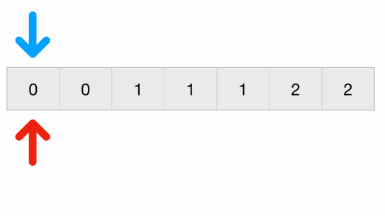

# Two Pointers: Same Direction
## Remove Duplicates
```
Given a sorted list of numbers, remove duplicates and return the new length.
You must do this in-place and without using extra memory.

Input: [0, 0, 1, 1, 1, 2, 2]

Your function should modify the list in place so the first 3 elements becomes 0, 1, 2
```
```javascript
function removeDuplicates(arr) {
  let slow = 0;
  const n = arr.length;
  for (let fast=1; fast<n; fast++) {
    if (arr[fast] !== arr[slow]) {
      slow++;
      arr[slow] = arr[fast];
    }
  }
  // if modifying of array is not required, return slow + 1;
  arr.splice(slow + 1, n - slow - 1);
  return arr.length;
}
```
### Explanation
- If we could use extra memory, we can easily solve this by going through the list once and using a hashset to record elements we have seen
- But we are not allowed extra memory so we have to look at the conditions and see if there's anything we could use
- An important condition is that the numbers are sorted, which means the same numbers are next to each other
  - This means as we go through the list, once we see a number A we will see all occurrences of A together
    - and will not see A again after we see B
- Using this key observation, we can devise a `fast/slow pointer solution`
- Time Complexity: `O(n)`
- We simply traverse the array once moving from left to right


