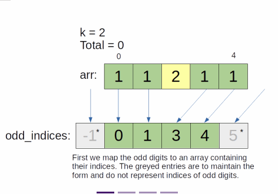

# Two Pointers: Sliding Window
## Count Number of Nice Subarrays
```
We define a "nice" array as an array that contains exactly k odd numbers, where k is a user-defined number.
In that case, given an array arr,
find the number of "nice" continuous subarrays of that array (the array itself is its own subarray).
Duplicate subarrays are counted as different subarrays as long as their index range is different.

Parameters
  k: An integer required for the definition of a "nice" array.
  arr: A list of integers representing the array.

Result
  An integer representing the number of nice subarrays of arr.

Example 1
  Input: k = 3, arr = [1, 1, 2, 1, 1]

Output: 2

Explanation: The nice subarrays are [1, 1, 2, 1] and [1, 2, 1, 1].

Example 2
  Input: k = 1, arr = [2, 4, 6, 8, 10]

Output: 0

Explanation: There are no odd integer in arr, so there are no odd subarrays.

Constraints
  1 <= k <= len(arr) <= 50000
  0 <= arr[i] <= 10^5
```
```javascript
// For the sake of easier calculation, let the zeroth odd index be -1.
// This way, we can easily calculate the number of even numbers before the first
// odd number using the same way as between two odd numbers.
const odds = [-1];
let answer = 0;

for (let i = 0; i < nums.length; i++) {
  if (nums[i] % 2 !== 0) odds.push(i);
}

// For the same reason as above, the final index is n, where n is the size of arr
odds.push(nums.length);

for (let i = 1; i < odds.length - k; i++) {
  const prevOdd = odds[i - 1];
  const firstOdd = odds[i];
  const lastOdd = odds[i + k - 1];
  const nextOdd = odds[i + k];
  answer += (firstOdd - prevOdd) * (nextOdd - lastOdd);
}
return answer;
```
```
input: 
  arr: 2 4 5 7 8 10 11 12 14 15 18 20
  k: 3
  
all possible scenarios
2 4 5 7 8 10 11 12 14
2 4 5 7 8 10 11 12
2 4 5 7 8 10 11
4 5 7 8 10 11 12 14
4 5 7 8 10 11 12
4 5 7 8 10 11
5 7 8 10 11 12 14
5 7 8 10 11 12
5 7 8 10 11
7 8 10 11 12 14 15 18 20
7 8 10 11 12 14 15 18
7 8 10 11 12 14 15

// add -1 at index 0 for easy calculation
// add arr length at last index as reference to the last not counted odd number
odd indexes arr = [-1, 2, 3, 6, 9, 12]
set i as 1 since that is where the index is within the arr
set n as odds arr length - k to set the number of acceptable subarrays
since k is 3, first range is [2, 3, 6], followed by [3, 6, 9]

calculate the total possibilities incrementing the following for each loop
(firstIndexOfOddNumInWindow - prevIndexOfOddNumOutsideWindow) * (nextToBeIndexOfOddNumOutsideWindow - prevLastIndexOfOddNumInWindow)
(a - b) * (c - d)

[-1, 2, 3, 6, 9, 12]
  b  a     d  c
  
(2 - -1) * (9 - 6) = 9
+
(3 - 2) * (12 - 6) = 3
= 12

output: 12
```



### Explanation
- Since only the odd numbers matter in this question, in the first pass, we simply store the indices to all odd numbers in the list
- Then, a nice subarray must contain k adjacent odd numbers if we ignore the even numbers
- All the even numbers between these odd numbers must be included, otherwise the subarray is not continuous
- However, at the start and end of the subarray
  - any number of even numbers before or after the array can be included as part of the nice array
  - as long as they are adjacent to each other and the array
- If there are n even numbers before the array, there are n + 1 options to choose from
- n can be calculated by subtracting the index of the first odd number in the subarray by the previous ones
  - and subtracting the result by 1
- Similarly, if there are m even numbers after, there are m + 1 options to choose from
- Therefore, given the odd numbers are the same, there are (n + 1) * (m + 1) different nice subarrays
- Then, it's simply a matter of a sliding window and collect the number of nice subarrays
- Time Complexity: `O(n)`

