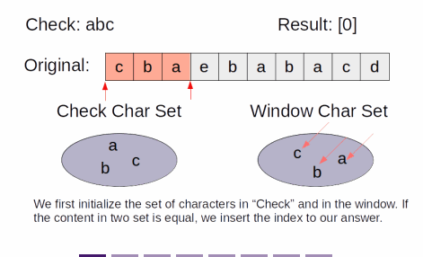

# Two Pointers: Sliding Window
## Find All Anagrams In A String
```
Given a string original and a string check,
find the starting index of all substrings of original that is an anagram of check.
The output must be sorted in ascending order.

Parameters
  original: A string
  check: A string

Result
  A list of integers representing the starting indices of all anagrams of check.

Example 1
  Input: original = "cbaebabacd", check = "abc"

  Output: [0, 6]

  Explanation: The substring from 0 to 2, "cba", is an anagram of "abc", and so is the substring from 6 to 8, "bac".


Example 2
  Input: original = "abab", check = "ab"

  Output: [0, 1, 2]

  Explanation: All substrings with length 2 from "abab" is an anagram of "ab".

Constraints
  1 <= len(original), len(check) <= 10^5
  Each string consists of only lowercase characters in standard English alphabet.
```
```javascript
function equalLetters(letters1, letters2) {
  for (let i = 0; i < letters1.length; i++) {
    if (letters1[i] !== letters2[i]) return false;
  }
  return true;
}

function updateLettersCount(letters, char, diff) {
  const letterIndex = char.charCodeAt() - 'a'.charCodeAt();
  letters[letterIndex] += diff;
}

function findAllAnagrams(original, check) {
  const originalLetters = new Array(26).fill(0);
  const checkLetters = new Array(26).fill(0);
  const originalLength = original.length;
  const checkLength = check.length;
  const result = [];

  for (let i = 0; i < checkLength; i++) {
    updateLettersCount(checkLetters, check[i], 1);
  }

  // move the window to the right at every cycle
  for (let i = 0; i < originalLength; i++) {
    updateLettersCount(originalLetters, original[i], 1);

    // after setting up the window, start popping the leftmost character at every cycle
    if (i >= checkLength) {
      updateLettersCount(originalLetters, original[i - checkLength], -1);
    }
    if (equalLetters(checkLetters, originalLetters)) {
      result.push(i - checkLength + 1);
    }
  }
  return result;
}
```



### Explanation
- This is a classical sliding window problem
- The sliding window is maintained at the size of check
  - and we keep track of the number of each type of characters inside the window in a hashmap
- Every cycle, we move the window to the right, pushing the rightmost character while popping the leftmost character
  - At every cycle, if the content of the window in the original matches the character count of check
    - that substring is an anagram, and we can insert the index into the resulting list
- Time Complexity: `O(n)`
