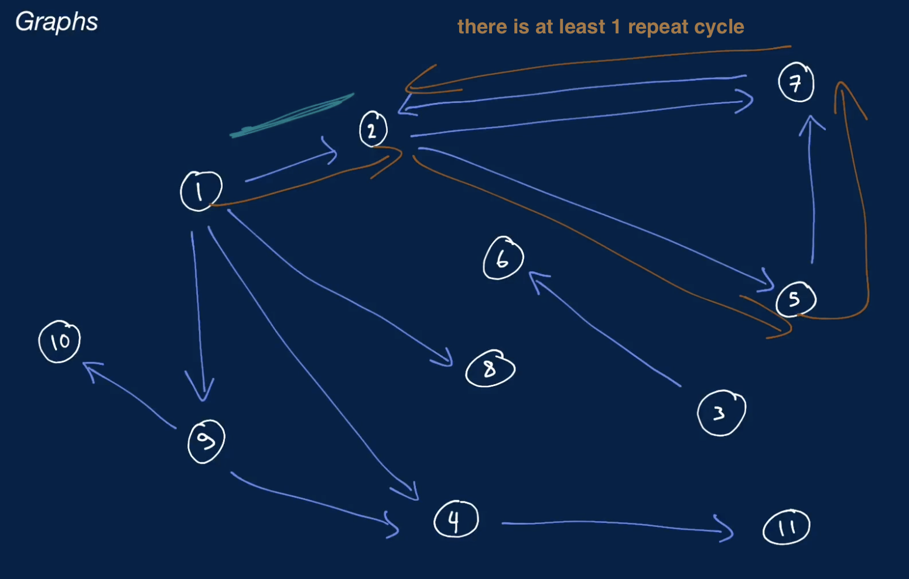
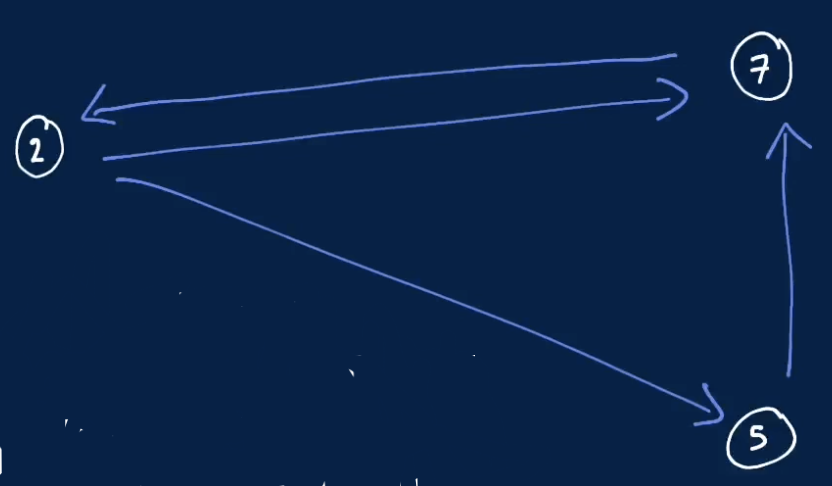
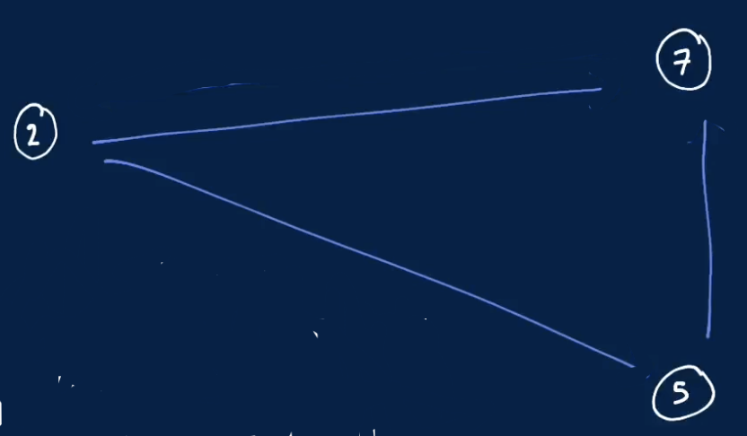
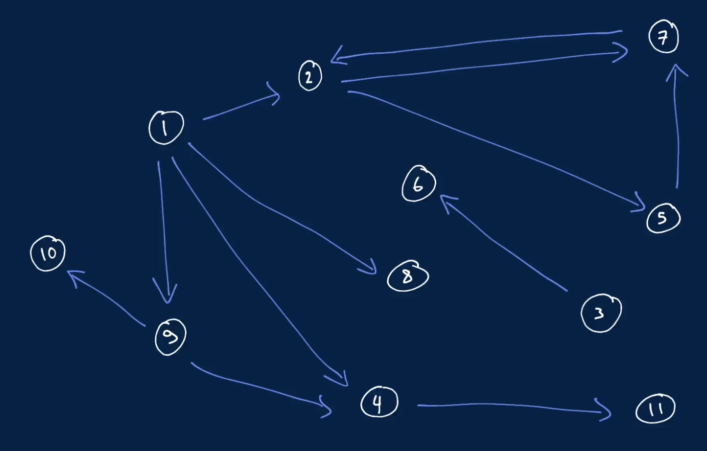

# Graphs
- a collection of nodes or values called verticles that might be related
  - relations between vertices are called edges
- many things in life can be represented by graphs
  - e.g. a social network can be represented by a graph whose vertices are users and whose edges are friendships between the users
  - similarly, a city map can be represented by a graph whose vertices are locations in the city and whose edges are roads between the locations
- typically, we represent a graph as an ```adjacency list```
  - it can store a list of nodes in the graph
    - every node stores value and a list of it's edges (or a list of it's adjacencies)
- a graph can also be represented by a 2 dimensional array
## Graph cycle
- a cycle occurs in a graph when 3 or more vertices in the graph are connected so as to form a closed loop
- note that the definition of a graph cycle is sometimes broadened to include cycles of length 2 or 1
  - in the context of coding interviews, when dealing with questions that involve graph cycles
    - it's important to clarify what exactly constitutes a cycle
### Acyclic Graph
- a graph that has no cycles
### Cyclic Graph

- a graph that has at least 1 cycle
- if you are traversing through the graph, and going down connections, and found yourself revisiting a connection that you have previously visited just by following the path of 3 edges
  - then that means there's a cycle in the graph
## Directed Graph

- a graph that whose edges are directed
  - meaning that they can only be traversed in 1 direction, which is specified
- for e.g. a graph of airports and flights would likely be directed
  - since a flight specifically goes from 1 airport to another (has a direction)
    - without necessarily implying the presence of a flight in the opposite direction
## Undirected Graph

- a graph whose edges are undirected, meaning that they can be traversed in both directions
- e.g. a graph of friends would likely be undirected, since friendship is by nature bidirectional
## Connected Graph

- a graph is connected if for every pair of vertices in the graph there's a path of 1 or more edges connecting the given vertices
- in the case of a directed graph, the graph is
  - strongly connected if there are bidirectional connections between the vertices of every pair of vertices
    - for every vertex-pair (u, v), can reach v from u and u from v
  - weakly connected if there are connections (but not necessarily bidirectional ones) between the vertices of every pair of vertices
## Disconnected Graph
- a graph that isn't connected is said to be disconnected

## standard operations and complexities
### Storing a graph: O(V + E) space
- storing V vertices (nodes)
  - V is the number of vertices in the graph
- storing E edges
  - E is the number of edges in the graph
### Traversing a graph: O(V + E) time
#### Depth First Search (DFS)
- traversing the graph deeper before going wide
#### Breath First Search (BFS)
- traversing the graph wider before going deep
