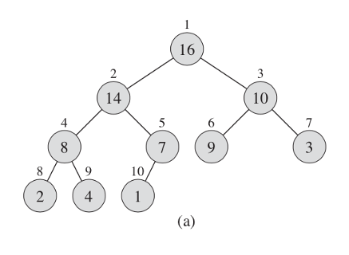
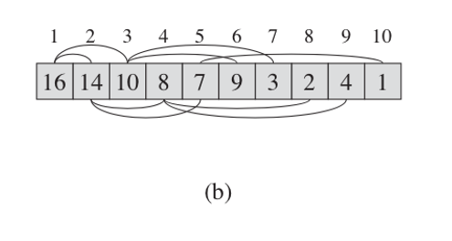
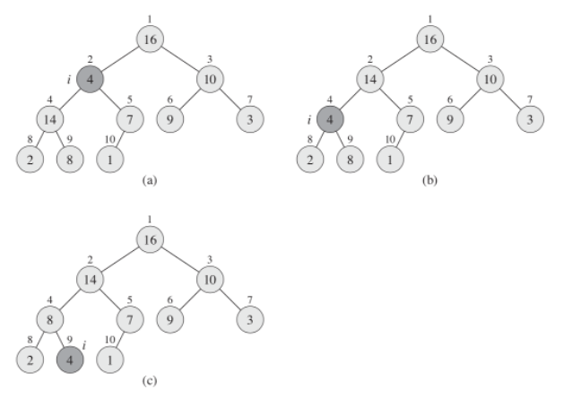

# Heap

- The (binary) heap data structure is an array object that we can view as a nearly complete binary tree
- Each node of the tree corresponds to an element of the array
- The tree is completely filled on all levels except possibly the lowest
  - which is filled from the left up to a point
- An array `A` that represents a heap is an object with two attributes:
  - `A.length` gives the number of elements in the array
  - `A.heap-size` represents how many elements in the heap are stored within array `A`
  - only elements in `A[1 .. A.heap-size]`
    - where `0 ≤ A.heap-size ≤ A.length` are valid elements of the heap
  - The root of the tree is `A[1]`
  - given the index i of a node
    - we can easily compute the indices of its parent, left child, and right child:
      - Parent: `i/2`
      - Left: `2i`
      - Right: `2i + 1`
- There are two kinds of binary heaps
  - max-heaps and min-heaps
  - In both kinds, the values in the nodes satisfy a heap property, the specifics of which depend on the kind of heap
  - In a max-heap, the max-heap property is that for every node i other than the root: `A[Parent(i)] ≥ A[i]`
    - max hip has the largest root node and the heap goes down
    - the largest element in a max-heap is stored at the root
    - the subtree rooted at a node contains values no larger than that contained at the node itself
  - A min-heap is organized in the opposite way
    - min has a minimum root node and goes up
    - the min-heap property is that for every node i other than the root: `A[Parent(i)] ≤ A[i]`
    - The smallest element in a min-heap is at the root
      - For the heap sort algorithm, we use max-heaps
      - Min-heaps commonly implement `priority queues`
- example

  - an array that we can represent as a tree
  - the numbers above the element in the array and the heap are the same, you can see how they are substituted into the leaves
  - It doesn't have to be an array, different programming languages have different data structures
    - it is more convenient to consider it as an array
  - Array `A`, which represents the heap
    - it also has attributes such as `length` - the number of elements in the array
    - And `heap-size`, the number of elements in the heap
    - The root of the tree is the first element in the array

  

  

  ```ts
  function maxHeapify(A, i) {
    let l = left(i);
    let r = right(i);

    if (l <= A.heapSize && A[l] > A[i]) {
      largest = l;
    } else {
      largest = i;
    }

    if (r <= A.heapSize && A[r] > A[largest]) {
      largest = r;
    }

    if (largest != i) {
      // exchange A[i] with A[largest]
      [A[i], A[largest]] = [A[largest], A[i]];

      maxHeapify(A[largest]);
    }
  }
  ```

## Maintaining the Heap Property

- In order to maintain the max-heap property, we call the function maxHeapify
  - When it is called, maxHeapify assumes that the binary trees rooted at left(i) and right(i) are max-heaps
    - but that A[i] might be smaller than its children, thus violating the max-heap property
  - Function maxHeapify lets the value at `A[i]` "float down" in the max-heap so that the subtree rooted at index i obeys the max-heap property
- example

  

  - heap must somehow support itself
    - when inserting or when deleting elements a heap rebuild should take place
      - this procedure can be called as `maxHeapify`
        - When it is called, we assume that the left and right nodes are also maxHeap
        - these nodes can be smaller than its children, and we have to let it go down below
        - the second element has ceased to meet the requirement, and we check the left heap until we reach the sheet
        - At each step, the largest of the elements `A[i]`, `A[left(i)]`, and `A[right(i)]` is determined, and its index is stored in largest
        - If `A[i]` is largest, then the subtree rooted at node i is already a max-heap and the procedure terminates
        - Otherwise, one of the two children has the largest element, and `A[i]` is swapped with `A[largest]`, which causes node i and its children to satisfy the max-heap property
        - The node indexed by largest, however, now has the original value `A[i]`, and thus the subtree rooted at largest might violate the max-heap property
        - Consequently, we call maxHeapify recursively on that subtree
      - The running time of maxHeapify on a subtree of size n rooted at a given node i is the `Θ(1)` time to fix up the relationships among the elements `A[i]`, `A[left(i)]`, and `A[right(i)]`
      - plus the time to run maxHeapify on a subtree rooted at one of the children of node i (assuming that the recursive call occurs)
      - The children's subtrees each have size at most `2n/3`
      - the worst case occurs when the bottom level of the tree is exactly half full—and therefore we can describe the running time of maxHeapify by the recurrence:
        - `O(log n)`

## Building a Heap

- The heap should be built using method `buildMaxHeap`
  - To do this, need to run the entire array through the maxHeapify function
  - the complexity becomes `O(n log n)`
    - have a linear dependency as it applies a function for each element and call maxHeapify itself
    - We can use the procedure maxHeapify in a bottom-up manner to convert an array `A[1..n]`, where `n = A.length`, into a max-heap
    - The elements in the subarray `A[(n/2+1)..n]` are all leaves of the tree, and so each is a 1-element heap to begin with
    - The function buildMaxHeap goes through the remaining nodes of the tree and runs maxHeapify on each one
- We can compute a simple upper bound on the running time of buildMaxHeap
  - Each call to maxHeapify costs O(lgn) time
  - Procedure buildMaxHeap makes `O(n)` calls
  - the running time is `O(n log n)`
    - This upper bound, though correct, is not asymptotically tight
