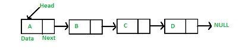
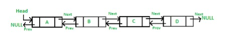
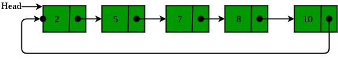
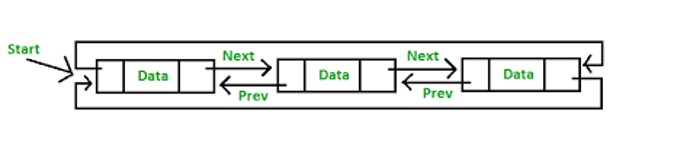

# Linked Lists

- it is a data structure in which the objects are arranged in a linear order
- order in a linked list is determined by a pointer in each object
- consists of nodes, each with some value and a pointer to the next node in the linked list
- a linked list node's value and next node are typically stored in `value` and `next` properties
- the 1st node in a linked list is referred to as the `head` of the linked list
- the last node in a linked list, whose `next` property points to the `null` value is known as the `tail` of the linked list
- linked lists differs from an array is in how it's implemented and how it's stored in memory
  - basically it would store each node (1 memory slot) with their pointer (1 memory slot) back to back
    - the pointer stores the memory address of the next node
    - each node and their respective pointers are not stored back to back with the other nodes and pointers in the memory
    - they are linked together via their pointers
    - in the case of a singly linked list, the last node would point to the memory address that contains the null value
- The advantage of this data structure is usage of pointers
  - In languages with manual memory allocation this allows data structures to allocate memory dynamically
  - In javascript, this advantage is mitigated in general, but other features of a double linked list could be used

```ts
class Node<T> {
  constructor(public element: T, public next?: Node<T>) {}
}
```

```ts
class DoublyNode<T> extends Node<T> {
  constructor(
    public element: T,
    public next?: DoublyNode<T>,
    public prev?: DoublyNode<T>
  ) {
    super(element, next);
  }
}
```

## Singly Linked List



- visual representation of a singly linked list whose nodes hold integer values
  - `0 -> 1 -> 2 -> 3 -> null`
- a singly linked list typically exposes its head to its user for easy access
  - while finding a node in a singly linked list involves traversing through all of the nodes leading up to the node in question (as opposed to instant access with an array)
    - adding or removing nodes involves overwriting `next` pointers (assuming that you have access to the node right before the node that you're adding or removing)

### standard operations and their complexities

#### Initialize a linked list: O(n) time, O(n) space

- this will create 2n memory slots, 1 for the node and 1 for the pointer
- it will also need to allocate the n chunks of memory thus will take n time

#### Accessing the head: O(1) time, O(1) space

- space is not affected

#### Accessing the tail: O(n) time, O(1) space

- requires to traverse the linked list to get the node
- space is not affected

#### Accessing a middle node: O(n) time, O(1) space

- requires to traverse the linked list to get the node
- space is not affected

#### Inserting / Removing the head: O(1) time, O(1) space

- none of the nodes are required to be shifted, therefore it only requires changing of the head reference which is only for 1 node making it constant time and space effort
- With add operation, memory is allocated for a new node and then the pointer in the last element is updated to point to the new node.

#### Inserting / Removing the tail: O(n) to access + O(1) to modify time, O(1) space

- requires traversing through the list before any changing of reference could be done, therefore time is linear to traverse but modification is constant

#### Inserting / Removing a middle node: O(n) to access + O(1) to modify time, O(1) space

- requires traversing through the list before any changing of reference could be done, therefore time is linear to traverse but modification is constant

#### Searching for a value: O(n) time, O(1) space

#### Traverse a linked list: O(n) time, O(1) space

- space is not affected

#### Copy a linked list: O(n) time, O(n) space

## Doubly Linked List



- similar to a singly linked list, except that each node in a doubly linked list also has a pointer to the previous node
  - the previous node is typically stored in a `prev` property
- just as the `next` property of a doubly linked list's `tail` points to the `null` value, the `prev` property of a doubly linked list `head` also points to the `null` value
- visual representation of a doubly linked list whose nodes hold integer values
  - `null <-> 0 <-> 1 <-> 2 <-> 3 <-> null`
- a doubly linked list typically exposes both its head and tail to its user
  - it also behaves very similarly to a singly linked list

### standard operations and their time complexities

#### Initialize a linked list: O(n) time, O(n) space

- this will create 2n memory slots, 1 for the node and 1 for the pointer
- it will also need to allocate the n chunks of memory thus will take n time

#### Accessing the head: O(1) time, O(1) space

#### Accessing the tail: O(1) time, O(1) space

#### Accessing a middle node: O(n) time, O(1) space

#### Inserting / Removing the head: O(1) time, O(1) space

#### Inserting / Removing the tail: O(1) time, O(1) space

#### Inserting / Removing a middle node: O(n) to access + O(1) to modify time, O(1) space

#### Searching for a value: O(n) time, O(1) space

#### Traverse a linked list: O(n) time, O(1) space

- space is not affected

#### Copy a linked list: O(n) time, O(n) space

## Circular Linked List / Cyclic Linked List



- a linked list that has no clear `head` or `tail`
  - because its `tail` points to its `head`
  - forming a closed circle
- it can be either singly circular linked list or a doubly circular linked list

## Circular Double Linked List / Cyclic Double Linked List



- the last element is pointing to the first and first points to the last
