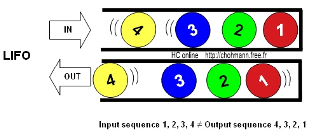
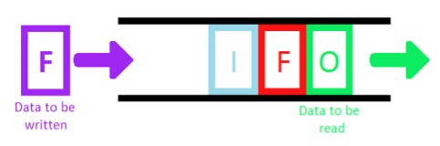

# Stacks and Queues

- Stacks and queues could be used in order to process certain types of operations

## Stack

- an array like data structure whose elements follow the Last In First Out (LIFO) rule
- a stack is often compared to a stack of books on a table
  - the last book that's placed on the stack of books is the 1st 1 that's taken off the stack
- a stack is typically implemented with a dynamic array or with a singly linked list
- example
  - we have a function that calls another function and it also calls a different function
  - the result from the innermost functions are being returned up
    - In a situation like this it's better to use a stack
  - We would take the uppermost function, start the execution until we reach a function call
    - At this moment we would take the state of execution of current function, put it into a stack and start execution of an inner function
    - This operation is repeated with every inner function
    - When the execution flow reaches a return statement, an item is removed from the stack and execution continues
- usage
  - a stack is useful for a reversal of elements
    - If a string is inserted into a stack, when popped it will be reversed
  - Other usage of a stack would be for storage of previous operations from Command pattern
    - In this case, if your commands have an undo operation, one could simply pop the last command and reverse its actions
  - usually implemented as a linked list or a dynamic array
    - if you need to find an element in a stack, it will take, in a worst-case O(n) time
    - Sorting a stack is also not an easy task

### Standard operations and complexities

#### Pushing an element onto the stack: O(1) time and space

- not using any additional space that grows with respect to the size of the input

#### Popping an element off the stack: O(1) time and space

#### Peeking at the element on the top of the stack: O(1) time and space

#### Searching for an element in the stack: O(n) time, O(1) space

### Max Stack

- keeps track of the largest element in the stack

## Min Stack

- keeps track of the smallest element in the stack

## Queue

- an array like data structure whose elements follow the First In First Out (FIFO) rule
- a queue is often compared to a group of people standing in line to purchase items at a store
  - the 1st person to get in line is the 1st 1 to purchase items and to get out of the queue
- a queue is typically implemented with a doubly linked list
  - because removing the 1st element in an array is not O(1) time
- usage
  - Queues are like stacks in terms of time needed for adding and removing an element
  - Queues are implemented using double linked list

### Standard operations and complexities

#### Enqueuing an element into the queue: O(1) time and space

#### Dequeuing an element out of the queue: O(1) time and space

#### Peeking at the element at the front of the queue: O(1) time and space

#### Searching for an element in the queue: O(n) time, O(1) space

### Priority queue

- keeps track of an element with high priority
- min heap is used for building a priority queue
- it is a data structure for maintaining a set S of elements, each with an associated value called a key
- A max-priority queue supports the following operations
  - `INSERT(S, x)` inserts the element x into the set S
  - `MAXIMUM(S)` returns the element of S with the largest key
  - `EXTRACT-MAX(S)` removes and returns the element of S with the largest key
  - `INCREASE-KEY(S, x, k)` increases the value of element xs key to the new value k, which is assumed to be at least as large as xs current key value
- This is a very good sort, but in most cases it is not the most optimal sort - reason why we are considering it is because on the basis of the heap
  - it is very good to build a queue with priority
  - For example, where you can use this queue
    - schedule a job on the server or use an event-driven approach when modeling physical processes with great complexity
    - For example, an event occurs with a minimum priority, it is executed, the time is recalculated, inserted into the queue, and the event we need appears at the top
    - Also, there are queues with the highest priority or with the lowest
      - You can insert an element into it, take the maximum element, extract the maximum element, and change the priority of some element
      - For example, processor time, there is a queue of tasks that it executes in one clock cycle, it performs a task, the priority changes
        - we insert it into the queue and take it with the next priority

### Double ended queue

- have both properties of a `queue` and a `stack`
