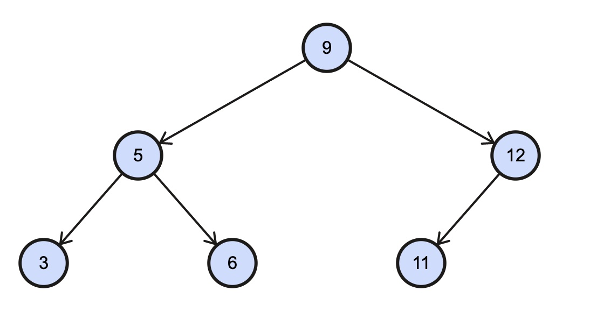
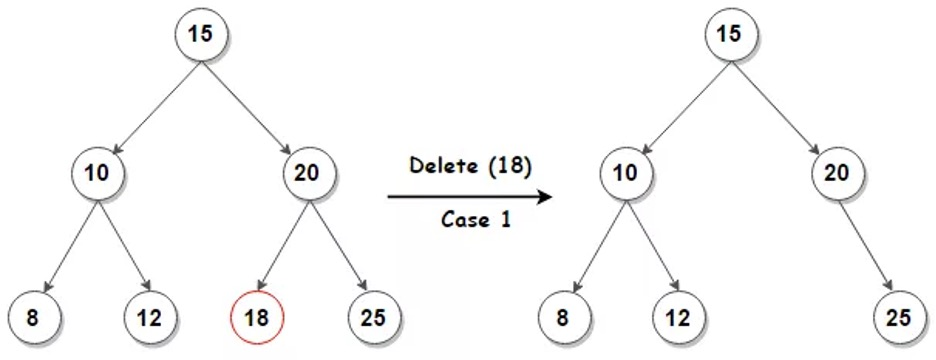
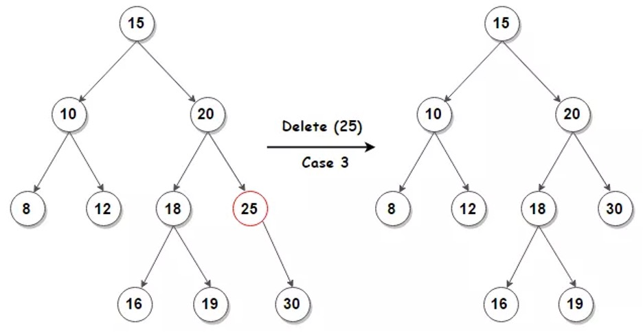
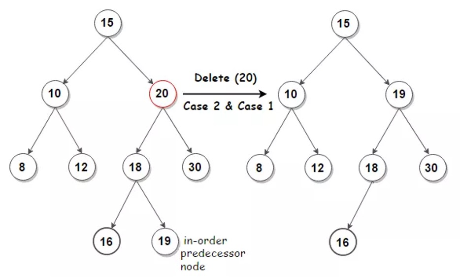

# Trees

- a special type of graph
- trees excel at storing data hierarchically and are commonly used as a means of testing your knowledge of recursion during coding interviews
- it is a data structure that consists of nodes, each with some value and pointers to child-nodes
  - which recursively form subtrees in the tree
- the 1st node in a tree is referred to as the root of the tree
  - while the nodes at the bottom of a tree (the nodes with no child-nodes) are referred to as leaf nodes or leaves
  - the paths between the root of a tree and its leaves are called branches
  - the height of a tree is the length of its longest branch
  - the depth of a tree node is its distance from its tree's root
    - also known as the node's level in the tree
- a tree is effectively a graph that's connected, directed, and acyclic
  - has an explicit root node, and whose nodes all have a single parent (except for the root node)
  - in most implementations of trees, tree nodes don't have a pointer to their parent, but can if desired

## Types of trees

### Binary Trees

- the root node has 2 child nodes
- every other nodes have up to 2 child nodes
- the structure of a binary tree is such that many of its operations have a logarithmic time complexity, making binary tree a commonly used data structure

```python
class Node:
  def __init__(self, value):
    self.value = value
    self.left = None
    self.right = None
```

```ts
class Node<T> {
  constructor(public value: T) {
    this.value = value;
    this.left = null;
    this.right = null;
  }
}
```

#### Binary Search Tree (BST)

- it is a node-based binary tree data structure which has the following properties
  - The left subtree of a node contains only nodes with values smaller than the node's value
  - The right subtree of a node contains only nodes with values bigger than the node's value
  - The left and right subtree each must also be a binary search tree or be null
- If a node is to be inserted into a tree, it is compared with current node (starting from the root)

  - If the node's value is less than current, we send it down to left subtree
  - If node's value is greater than or equal to current
    - it is sent to the right subtree
    - This process is repeated for each encountered node



#### K-ary Tree

- a tree where every node (including the root) have up to k child nodes
  - e.g.: a binary tree is a k-ary tree where k === 2

#### Perfect Binary Tree

- a binary tree whose interior nodes all have 2 child nodes and whose leaf nodes all have the same depth
  ```
          1
      /         \
     2           3
    /  \       /   \
   4    5     6     7
   /\   /\    /\    /\
  8  9 10 11 12 13 14 15
  ```

#### Complete Binary Tree

- a binary tree that's almost perfect
- its interior nodes all have 2 child nodes
- but its leaf nodes don't necessarily all have the same depth
- furthermore, the nodes in the last level of a complete binary tree are as far left as possible
  ```
        1
      /   \
     2     3
    / \   / \
   4   5 6   7
   /\
  8  9
  ```
- a binary tree is incomplete if the nodes in its last level aren't as far left as possible
  ```
        1
      /   \
     2     3
    / \   / \
   4   5 6   7
      /   \
     8     9
  ```

#### Balanced Binary Tree

```
       1
     /    \
    2      3
   / \    / \
  4   5  6   7
 / \        /
10  9      8
```

- a binary tree whose nodes all have left and right subtrees whose heights differ by no more than 1
- a balanced binary tree is such that the logarithmic time complexity `O(log n)` of its operations is maintained
- e.g.: inserting a node at the bottom of the following imbalanced binary tree's left subtree would clearly not be a logarithmic-time operation, since it would involve traversing through most of the tree's nodes
  ```
           1
         /  \
        2    3
       /
      4
     /
    8
   /
  10
  ```

#### Full Binary Tree

- a binary tree whose nodes all have either 2 child nodes or 0 child nodes
  ```
    1
   / \
  2   3
     / \
    6   7
   / \
  8   9
  ```

### Heaps

- they are typically binary heaps
- a special type of binary trees, where every node in the tree satisfies the min or max heap property

#### Min Heaps

#### Max Heaps

### Ternary Tree

- the root node has 3 child nodes
- every other nodes have up to 3 child nodes

### Tries

- a tree like data structure that typically stores characters in a string

### AVL Trees

- able to rebalance themselves to obtain the log N complexity

### Red Black Trees

- able to rebalance themselves to obtain the log N complexity

## standard operations and complexities

### Storing all types of tree: O(N) space

- N is the total number of nodes in the tree

### Traversing through the entire tree: O(N) time

### Traversing 1 subtree at every step for a balance binary tree: O(log N) time on average

- if the tree is skewed, it becomes O(N) time on worst

### Search, Insert, Delete

- for Binary Search Tree: `O(h)`
  - h is the height of the BST
- for skewed tree: `O(n)`
  - n is the number of nodes

## Traversal Types

- Using Recursion

| pros                                                                        | cons                                                                                   |
| --------------------------------------------------------------------------- | -------------------------------------------------------------------------------------- |
| The code may be easier to write                                             | Recursive functions are generally slower than non-recursive function                   |
| To solve such problems which are naturally recursive such as tower of Hanoi | It may require a lot of memory space to hold intermediate results on the system stacks |
| Reduce unnecessary calling of function                                      | Hard to analyze or understand the code                                                 |
| Extremely useful when applying the same solution                            | It is not more efficient in terms of space and time complexity                         |
| Recursion reduce the length of code                                         | The computer may run out of memory if the recursive calls are not properly checked     |
| It is very useful in solving the data structure problem                     |                                                                                        |
| Stacks evolutions and infix, prefix, postfix evaluations etc                |                                                                                        |

### Breath First Traversal

### Depth First Traversal

#### Inorder (Left, Root, Right)

- example
  - 3, 5, 6, 9, 11, 12
- prints the values in the left subtree, then the value of the root subtree, then the right subtree

1. Traverse the left subtree, i.e., call Inorder(left-subtree)
2. Visit the root.
3. Traverse the right subtree, i.e., call Inorder(right-subtree)

```python
def in_order(current_node):
  if current_node:
    in_order(current_node.left)
    print(current_node.value)
    in_order(current_node.right)
```

```ts
function inOrder(node: Node | null) {
  if (node) {
    inOrder(node.left);
    console.log(node.value);
    inOrder(node.right);
  }
}
```

```python
def in_order(root):
  if root is None:
    return

  node_stack = []
  node_stack.append(root)

  while(len(node_stack) > 0):
    current_node = node_stack.pop()

    # Note that right child is pushed first so that left is processed first
    if current_node.right:
      node_stack.append(current_node.right)

    print(current_node.value)

    if current_node.left:
      node_stack.append(current_node.left)
```

#### Preorder (Root, Left, Right)

- example
  - 9, 5, 3, 6, 12, 11
- prints the root value, then value in left subtree, then value in right subtree

1. Visit the root.
2. Traverse the left subtree, i.e., call Preorder(left-subtree)
3. Traverse the right subtree, i.e., call Preorder(right-subtree)

```python
def pre_order(current_node):
  if current_node:
    print(current_node.value)
    pre_order(current_node.left)
    pre_order(current_node.right)
```

```ts
function preOrder(node: Node | null) {
  if (node) {
    console.log(node.value);
    preOrder(node.left);
    preOrder(node.right);
  }
}
```

```python
def pre_order(root):
  if root is None:
    return

  node_stack = []
  node_stack.append(root)

  while(len(node_stack) > 0):
    current = node_stack.pop()
    print(current.value)

    # Note that right child is pushed first so that left is processed first
    if current.right:
      node_stack.append(current.right)
    if current.left:
      node_stack.append(current.left)
```

#### Postorder (Left, Right, Root)

- example
  - 3, 6, 5, 11, 12, 9
- prints the value of the left subtree, then the value of the right subtree, then the root value

1. Traverse the left subtree, i.e., call Postorder(left-subtree)
2. Traverse the right subtree, i.e., call Postorder(right-subtree)
3. Visit the root.

```python
def post_order(current_node):
  if current_node:
    post_order(current_node.left)
    post_order(current_node.right)
    print(current_node.value)
```

```ts
function postOrder(node: TreeNode | null) {
  if (node) {
    postOrder(node.left);
    postOrder(node.right);
    console.log(node.value);
  }
}
```

```python
def post_order(root):
  if root is None:
    return

  node_stack = []
  node_stack.append(root)

  while(len(node_stack) > 0):
    current = node_stack.pop()

    # Note that right child is pushed first so that left is processed first
    if current.right:
      node_stack.append(current.right)
    if current.left:
      node_stack.append(current.left)

    print(current.value)
```

## Binary Search

```python
def binary_search(current, target):
  if current is None:
    return None

  if current.value == target:
    return current

  if target > current.value:
    return binary_search(current.right, target)

  if target < current.value:
    return binary_search(current.left, target)

  return None
```

```ts
function binarySearch(current: Node | null, target: number): Node | null {
  if (current === null) {
    return null;
  }

  if (target === current.value) {
    return current;
  }

  if (target > current.value) {
    return binarySearch(current.right, target);
  }

  if (target < current.value) {
    return binarySearch(current.left, target);
  }

  return null;
}
```

```python
def binary_search(tree, target):
  current = tree
  while current:
    if current.value == target:
      return current.value
    if target > current.value:
      current = current.right
    elif target < current.value:
      current = current.left
    else:
      break
  return None
```

## Min and Max of Binary Search Trees

### Min

- value is a minimum by following left child pointers from the root until we encounter a null

```ts
function treeMinimum(node: Node) {
  while (node.left) {
    node = node.left;
  }

  return node;
}
```

### Max

- value is a maximum by following right child pointers from the root until we encounter a null

```ts
function treeMaximum(node: Node) {
  while (node.right) {
    node = node.right;
  }

  return node;
}
```

## Successor

- it is the node with the smallest value greater than targetNode.value

```ts
function getSuccessor(tree: Node, targetNode: Node) {
  if (tree === targetNode) {
    return null;
  }

  if (targetNode.right) {
    return treeMinimum(targetNode.right);
  }

  let successor = null;
  let currentNode: Node | null = tree;

  while (currentNode) {
    if (currentNode.value <= targetNode.value) {
      currentNode = currentNode.right;
    } else {
      successor = currentNode;
      currentNode = currentNode.left;
    }
  }

  return successor;
}
```

## Insertions

```ts
function insertNode(tree: Node | null, node: Node) {
  if (!tree) {
    return node;
  }

  let leafNode: Node | null = tree;
  let leafNodeParent: Node = tree;

  while (leafNode) {
    leafNodeParent = leafNode;

    leafNode = node.value < leafNode.value ? leafNode.left : leafNode.right;
  }

  if (node.value < leafNodeParent.value) {
    leafNodeParent.left = node;
  } else {
    leafNodeParent.right = node;
  }
}
```

## Deletion

- The overall strategy for deleting a node node from a binary search tree tree has three basic cases

  - If node is leaf (has no children)

    - then remove it by modifying its parent to replace node with null as its child

    

  - If node has just one child

    - then elevate that child to take nodes position in the tree by modifying node parent to replace node by nodes child

    

  - If node has two children

    - then find node successor parent
      - must be in node right subtree
      - and have parent take nodes position in the tree
    - The rest of nodes original right subtree becomes parents new right subtree, and nodes left subtree becomes parents new left subtree
    - This case is the tricky because it matters whether parent is nodes right child

    

```ts
function deleteNode(tree: Node | null, value: number): Node | null {
  if (tree === null) {
    return tree;
  }

  if (value < tree.value) {
    tree.left = deleteNode(tree.left, value);
  } else if (value > tree.value) {
    tree.right = deleteNode(tree.right, value);
  }
  // this is the node to be deleted
  else {
    // node with only one child or no child
    if (tree.left === null) {
      return tree.right;
    }

    if (tree.right === null) {
      return tree.left;
    }

    // node with two children: get the inorder predecessor (largest in the left subtree)
    tree.value = treeMaximum(tree.left).value;

    // delete the inorder predecessor
    tree.left = deleteNode(tree.left, tree.value);
  }

  return tree;
}
```

- full Binary Search Tree example

  - utils

    ```ts
    enum Compare {
      LessThan = -1,
      BiggerThan = 1,
      Equals = 0,
    }

    function compare<T>(a: T, b: T): number {
      if (a === b) {
        return Compare.Equals;
      }
      return a < b ? Compare.LessThan : Compare.BiggerThan;
    }
    ```

  ```ts
  export class Node<T> {
    public left: Node<T> = null;
    public right: Node<T> = null;

    constructor(public value: T) {
      this.value = value;
    }

    public toString() {
      return `${this.value}`;
    }
  }
  ```

  ```ts
  class BinarySearchTree<T> {
    protected root: Node<T> = null;

    /**
     * @description: insert element
     */
    public insert(value: T) {
      if (this.root === null) {
        // edge case: insert into root node
        this.root = new Node(value);
      } else {
        // recursively find the insertion position
        this.insertNode(this.root, value);
      }
    }

    /**
     * @description: recursive insertion method
     */
    protected insertNode(node: Node<T>, value: T) {
      if (compare(value, node.value) === Compare.LessThan) {
        // If the value is smaller than node.value, go to the left
        if (node.left === null) {
          // Baseline condition: the left side is empty and directly assigned
          node.left = new Node(value);
        } else {
          // otherwise recurse
          this.insertNode(node.left, value);
        }
        // If the value is larger than node.value, go to the right
      } else if (node.right === null) {
        // Baseline condition: the right side is empty and directly assigned
        node.right = new Node(value);
      } else {
        // otherwise recurse
        this.insertNode(node.right, value);
      }
    }

    /**
     * @description: return the root node
     */
    public getRoot() {
      return this.root;
    }

    /**
     * @description: search element
     */
    public search(value: T) {
      // call recursive search element method
      return this.searchNode(this.root, value);
    }

    /**
     * @description: recursive search element method
     */
    private searchNode(node: Node<T>, value: T): boolean {
      // Baseline condition: return false when null is found
      if (node === null) {
        return false;
      }

      if (compare(value, node.value) === Compare.LessThan) {
        // value is smaller than node.value, look left
        return this.searchNode(node.left, value);
      } else if (compare(value, node.value) === Compare.BiggerThan) {
        // value is bigger than node.value, look right
        return this.searchNode(node.right, value);
      }
      // value is equal to node.value, element is found
      return true;
    }

    public inOrderTraverse(callback: Function) {
      this.inOrderTraverseNode(this.root, callback);
    }

    private inOrderTraverseNode(node: Node<T>, callback: Function) {
      if (node !== null) {
        this.inOrderTraverseNode(node.left, callback);
        callback(node.value);
        this.inOrderTraverseNode(node.right, callback);
      }
    }

    public preOrderTraverse(callback: Function) {
      this.preOrderTraverseNode(this.root, callback);
    }

    private preOrderTraverseNode(node: Node<T>, callback: Function) {
      if (node !== null) {
        callback(node.value);
        this.preOrderTraverseNode(node.left, callback);
        this.preOrderTraverseNode(node.right, callback);
      }
    }

    postOrderTraverse(callback: Function) {
      this.postOrderTraverseNode(this.root, callback);
    }

    private postOrderTraverseNode(node: Node<T>, callback: Function) {
      if (node !== null) {
        this.postOrderTraverseNode(node.left, callback);
        this.postOrderTraverseNode(node.right, callback);
        callback(node.value);
      }
    }

    /**
     * @description: return smallest element in tree
     */
    public min() {
      // call iterator method
      return this.minNode(this.root);
    }

    /**
     * @description: returns the smallest element under the specified subtree
     */
    protected minNode(node: Node<T>) {
      let current = node;

      // keep looking left
      while (current !== null && current.left !== null) {
        current = current.left;
      }
      return current;
    }

    /**
     * @description: return largest element in tree
     */
    public max() {
      // call iterator method
      return this.maxNode(this.root);
    }

    /**
     * @description: returns the largest element under the specified subtree
     */
    protected maxNode(node: Node<T>) {
      let current = node;

      // keep looking right
      while (current !== null && current.right !== null) {
        current = current.right;
      }
      return current;
    }

    /**
     * @description: remove the specified element
     */
    public remove(value: T) {
      // Call the recursive method, the recursion here is special, and the deleted tree will be returned
      this.root = this.removeNode(this.root, value);
    }

    /**
     * @description: A recursive method that removes the specified element in the specified subtree. After each processing, the processed node needs to be returned to this node
     */
    protected removeNode(node: Node<T>, value: T) {
      // baseline condition
      if (node === null) {
        return null;
      }

      if (compare(value, node.value) === Compare.LessThan) {
        // When the value is less than node.value, look left
        node.left = this.removeNode(node.left, value);
        return node;
      } else if (compare(value, node.value) === Compare.BiggerThan) {
        // When the value is greater than node.value, look to the right
        node.right = this.removeNode(node.right, value);
        return node;
      } else {
        // value is equal to node.value
        // At this point, the node to be deleted has been found
        // handle 3 special conditions

        // case 1: When the node to be deleted is a leaf node
        if (node.left === null && node.right === null) {
          node = null;
          return node;
        }

        // case 2: When the node to delete has only one right child
        if (node.left === null) {
          node = node.right;
          return node;
          // The same deleted node has only one left child node
        } else if (node.right === null) {
          node = node.left;
          return node;
        }

        // case 3: When the node to be deleted has two children
        const aux = this.minNode(node.right);
        node.value = aux.value;
        node.right = this.removeNode(node.right, aux.value);
        return node;
      }
    }
  }
  ```

  ```ts
  let tree = new BinarySearchTree<number>();
  console.log(tree.getRoot());

  tree.insert(11);
  tree.insert(7);
  tree.insert(15);
  tree.insert(5);
  tree.insert(3);
  tree.insert(9);
  tree.insert(8);
  tree.insert(10);
  tree.insert(13);
  tree.insert(12);
  tree.insert(14);
  tree.insert(20);
  tree.insert(18);
  tree.insert(25);
  console.log(tree.getRoot());
  console.log(tree.getRoot().left);
  console.log(tree.getRoot().right);

  tree.preOrderTraverse(console.log);
  tree.inOrderTraverse(console.log);
  tree.postOrderTraverse(console.log);

  console.log(tree.search(8));
  console.log(tree.search(0));
  console.log(tree.min());
  console.log(tree.max());
  console.log(tree.remove(8));
  console.log(tree.search(8));
  ```
