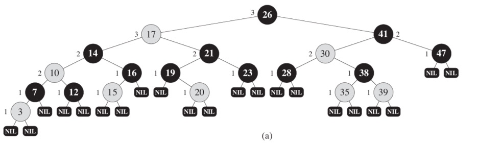
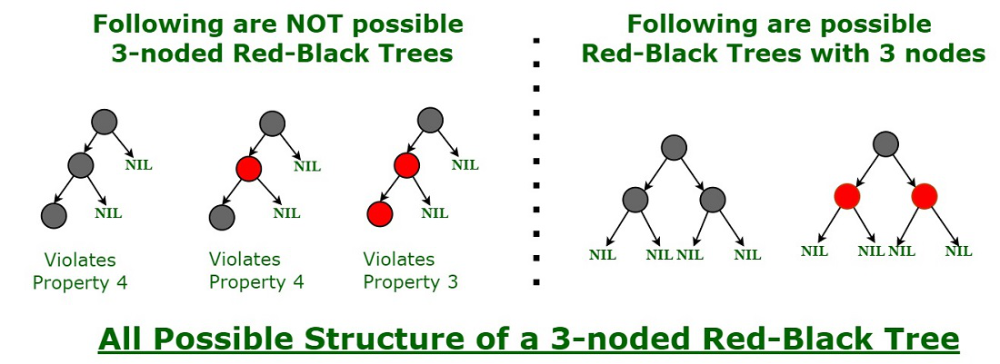
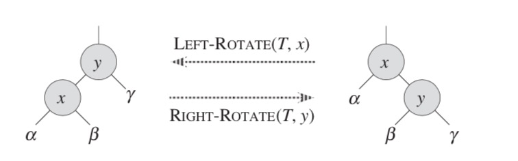
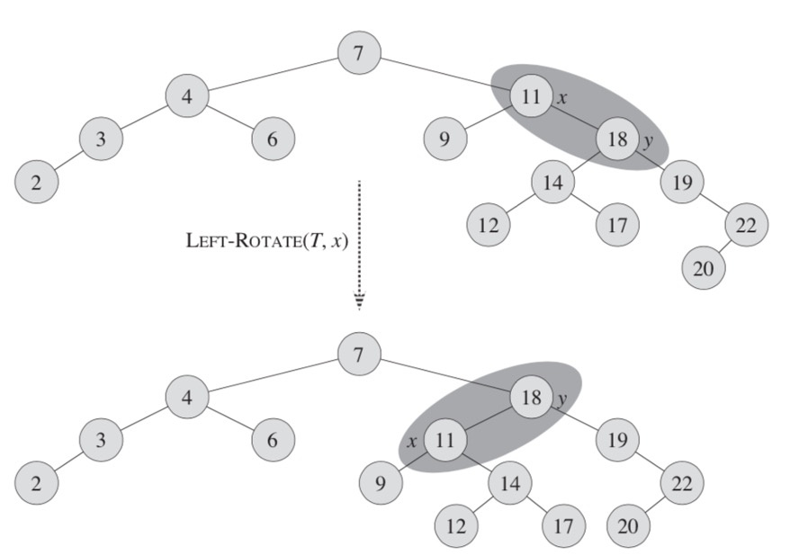

# Red-Black Tree



- it is a self-balancing binary search tree with one extra bit of storage per node
  - its color can be either RED or BLACK
  - By constraining the node colors on any simple path from the root to a leaf
    - red-black trees ensure that no such path is more than twice as long as any other, so that the tree is approximately balanced
- Each node of the tree contains the attributes
  - color, value, left, right, and parent
- If a child or the parent of a node does not exist, the corresponding pointer attribute of the node contains the value null
  - We regard these nulls as being pointers to leaves (external nodes) of the binary search tree and the normal, key-bearing nodes as being internal nodes of the tree
- it is a binary tree that satisfies the following red-black properties
  1. Every node is either red or black
  2. The root is black
  3. all leaf node are black
  4. If a node is red, then both its children and parent are black
  5. Every path from a node (including root) to any of its descendants NULL nodes has the same number of black nodes
- it also has a lemma
  - a tree with n internal nodes has height at most `2log (n + 1)`

## Why Red-Black Trees?

- Most of the BST operations (e.g., search, max, min, insert, delete.. etc) take `O(h)` time where h is the height of the BST
- The cost of these operations may become `O(n)` for a skewed Binary tree
- If we make sure that the height of the tree remains `O(log n)` after every insertion and deletion
  - then we can guarantee an upper bound of `O(log n)` for all these operations
- The height of a Red-Black tree is always `O(log n)` where n is the number of nodes in the tree

| Method | Time Complexity |
| ------ | --------------- |
| Search | `O(log n)`      |
| Insert | `O(log n)`      |
| Delete | `O(log n)`      |

## Comparison with AVL Tree

- The AVL trees are more balanced compared to Red-Black Trees
  - but they may cause more rotations during insertion and deletion
- if the application involves frequent insertions and deletions
  - then Red-Black trees should be preferred
- if the insertions and deletions are less frequent and search is a more frequent operation
  - then AVL tree should be preferred over the Red-Black Tree

## How does a Red-Black Tree ensure balance?



## Applications:

- Most of the self-balancing BST library functions like map, multiset, and multimap in C++ ( or java packages like java.util.TreeMap and java.util.TreeSet ) use Red-Black Trees
- It is used to implement CPU Scheduling Linux
  - Completely Fair Scheduler uses it
- It is used in the K-mean clustering algorithm in machine learning for reducing time complexity
- MySQL also uses the Red-Black tree for indexes on tables in order to reduce the searching and insertion time

## Insert and Delete



- search-tree operations `TREE-INSERT` and `TREE-DELETE`
  - when run on a red-black tree with n keys, take `O(log n)` time
    - Because they modify the tree, the result may violate the red-black properties
    - To restore these properties, we must change the colors of some nodes in the tree and also change the pointer structure
- We change the pointer structure through rotation
  - which is a local operation in a search tree that preserves the binary-search-tree property
  - When we do a left rotation on a node x
    - we assume that its right child y is not null
    - x may be any node in the tree whose right child is not null
    - The left rotation "pivots" around the link from x to y
    - It makes y the new root of the subtree, with x as ys left child and ys left child as xs right child
- rotate left example

  

  - rotating element x in a tree T left
    - After a rotation, the y element "pulls" its right subtree up (elements 19, 20, 22)
    - Left subtree of x (9) stays the same, and left subtree of y becomes right subtree of x

  ```ts
  rotateLeft() {
    let y = this.right;
    this.right = y.left;

    if (!y.left.isNil) {
      y.left.parent = this;
    }

    if (!y.isNil) y.parent = this.parent;

    if (this.parent) {
      if (this.id === this.parent.left.id) {
        this.parent.left = y;
      } else {
        this.parent.right = y;
      }
    } else {
      this.tree.root = y;
    }

    y.left = this;
    if (!this.isNil) this.parent = y;
  }
  ```

- rotate right example

  ```ts
  rotateRight() {
    let y = this.left;
    this.left = y.right;

    if (!y.right.isNil) {
      y.right.parent = this;
    }

    if (!y.isNil) y.parent = this.parent;

    if (this.parent) {
      if (this.id === this.parent.right.id) {
        this.parent.right = y;
      } else {
        this.parent.left = y;
      }
    } else {
      this.tree.root = y;
    }

    y.right = this;
    if (!this.isNil) this.parent = y;
  }
  ```

### Insertion

- To insert a node, first we have to find a place to insert it into
  - The new node will always be added as a leaf
  - This means that both of his children are NIL and are black
  - The newly added node will always be red
- example

  ```ts
  insertNode(data) {
    let current, parent, x;
    current = this.root;
    parent = null;

    while (!current.isNil) {
      if (data === current.value) return current;

      parent = current;
      current = data < current.value ? current.left : current.right;
    }

    x = new rbNode(this);
    x.value = data;
    x.parent = parent;
    x.isRed = true;
    x.isNil = false;

    x.left = new rbNode(this);
    x.right = new rbNode(this);

    if (parent) {
      if (x.value < parent.value) {
        parent.left = x;
      } else {
        parent.right = x;
      }
    } else {
      this.root = x;
    }

    this.insertFixup(x);

    return x;
  }
  ```

### Insert Fix up

- After insertion, we perform a insertFixup operation defined as following
- example

  - To perform the fixup, we have to look at the parent, and check if the red-black property is followed
  - If the parent node is black
    - we can exit
  - If parent node is red
    - we recolor it black and preform a rotation to balance the tree
  - By inserting a red node with 2 NIL-children, we are keeping the property of black height (property 4)
    - Although, this could mean that we are breaking the property 3
      - according to which both children of a red node have to be black
        So, let's look at a situation when a parent of a new node is red, by which the property 3 will be violated

  ```ts
  insertFixup(x) {
    while (x.id !== this.root.id && x.parent.isRed) {
      if (x.parent.id === x.parent.parent.left.id) {
        let y = x.parent.parent.right;

        if (y.isRed) {
          x.parent.isRed = false;
          y.isRed = false;
          x.parent.parent.isRed = true;
          x = x.parent.parent;
        } else {
          if (x.id === x.parent.right.id) {
            x = x.parent;
            x.rotateLeft();
          }

          x.parent.isRed = false;
          x.parent.parent.isRed = true;
          x.parent.parent.rotateRight();
        }
      } else {
        let y = x.parent.parent.left;

        if (y.isRed) {
          x.parent.isRed = false;
          y.isRed = false;
          x.parent.parent.isRed = true;
          x = x.parent.parent;
        } else {
          if (x.id === x.parent.left.id) {
            x = x.parent;
            x.rotateRight();
          }

          x.parent.isRed = false;
          x.parent.parent.isRed = true;
          x.parent.parent.rotateLeft();
        }
      }
    }

    this.root.isRed = false;
  }
  ```
