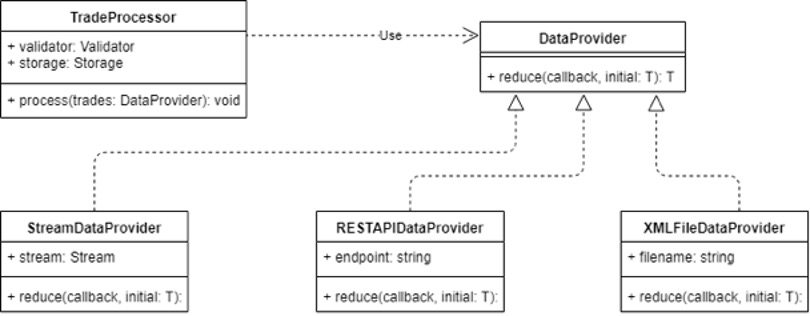

# Open Closed Principle (OCP)

- Software entities (classes, modules, functions, etc.)
  - `should be open for extension`
    - It means that the behavior of the module can be extended
    - When the requirements for the application change, we add new behavior to the module to meet the changed requirements
  - `but closed for modification`
    - It means that extending a module's behavior does not involve changes to the source code of the module
- the entity can allow its behavior to be extended without modifying its source code
- In other words, we should be able to change the behavior of the module without changing the module itself

## 2 types

- Both ways use generalizations (for instance, inheritance or delegate functions) to resolve the apparent dilemma, but the goals, techniques, and results are different

### Meyer's open-closed principle

- A module is open if it is still available for extension
  - e.g.: it should be possible to add fields to the data structures it contains, or new elements to the set of functions it performs
- A module is closed if is available for use by other modules
  - This assumes that the module has been given a well-defined, stable description (the interface in the sense of information hiding)
- A class is closed, since it may be compiled, stored in a library, baselined, and used by client classes
  - But it is also open, since any new class may use it as parent, adding new features
  - When a descendant class is defined, there is no need to change the original or to disturb its clients

### Polymorphic open-closed principle

- open-closed principle refer to the use of abstracted interfaces
  - where the implementations can be changed and multiple implementations could be created and polymorphically substituted for each other
- this advocates inheritance from abstract base classes
  - Interface specifications can be reused through inheritance but implementation need not be
  - The existing interface is closed to modifications and new implementations must, at a minimum, implement that interface

## Example

- When we removed data retrieval, parsing and saving from `TradeProcessor` class and created separate class for each type of responsibility, we made `TradeProcessor` class to conform to OCP
  - If the requirements change, we can get completely different functionality without changing the TradeProcessor itself
- Suppose at some point we were given requirement to support multiple data sources at the same time (stream, REST API and XML file)
  - It is not a problem for us
  - We can use polymorphic DataProvider in TradeProcessor
  - As you can see on the diagram below, we have created classes for every data source:
    - `StreamDataProvider`, `RESTAPIDataProvider` and `XMLFileDataProvider`
    - All of them are inherited from base `DataProvider` class and override `reduce()` method
    - So, in the future, whenever we need to receive data from some new sources, we will do exactly the same thing
    - Therefore, OCP is not violated
    - We are closed for modifications (no need to change DataProvider class) and at the same time we are open for expansion



### Single Choice Principle

- Suppose we have a hierarchy of classes designed to import data from files of different formats
  - We also have a factory method that creates the required Importer depending on the file extension
- Does the implementation of such a factory comply with the OCP?
  - Or do we need to introduce an ImporterFactory interface and factory hierarchy to comply with this principle?
- The factory method by itself already hides the way to get the desired Importer from its customers and an additional level of indirection is not needed here

```ts
class ImporterFactory {
  public static create(fileName: string): Importer {
    switch (getExtension(fileName)) {
      case "json":
        return new JsonImporter();
      case "xls":
      case "xlsx":
        return new XlsImporter();
      default:
        throw new Error("Extension is not supported");
    }
  }
}
```

- according to `Bertrand Meyer`
  - It is necessary to admit the possibility that the list of variants, given and known at some stage of program development, may subsequently be changed by adding or removing variants
  - To ensure that this approach to the software development process is implemented, you need to find a way to protect the program structure from the impact of such changes
  - Hence, follows the principle of Single Choice
- In other words: **whenever a software system needs to support multiple alternatives, only one module of the system should know the complete list**

## Summary

- essence of OCP
  - design modules so that their functionality can be expanded with other modules if requirements change
    - new functionality should appear only by creating new entities and composing them with old ones
  - design modules so that, ideally, their code does not need to be changed when requirements change
    - there are always changes that cannot be made without changing the code of some module
      - no system can be 100% closed
      - therefore, a strategic approach is important when designing
      - it is necessary to determine from which changes and which modules you want to close
  - design modules to relate to each other through abstractions rather than specific implementation
    - the principle encourages linking entities through abstractions (rather than implementation) where business requirements may change
- benefits of OCP
  - reduces the amount of code that needs to be changed as business requirements change
  - makes modification safe and relatively cheap
- the goal of OCP is to minimize changes to existing classes when new functionality is added
  - It is achieved by adding extension points (not just inheritance) that allow us to take advantage of powerful tools like composition, aggregation, and polymorphism
