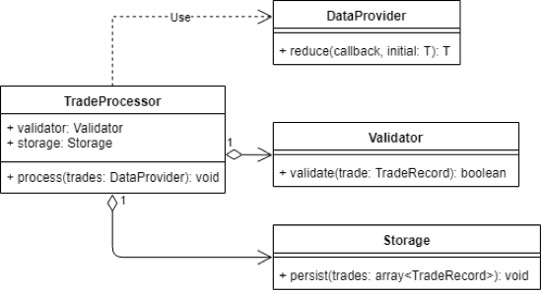

# Single Responsibility Principle (SRP)

- `A class should have one and only one reason to change, meaning that a class should have only one job`
- Classes, software components and microservices that have only one responsibility are much easier to explain, understand and implement than the ones that provide a solution for everything
  - This reduces the number of bugs, improves your development speed, and makes your life as a software developer a lot easier
- Unfortunately, following the single responsibility principle sounds a lot easier than it often is
  - If you build your software over a longer period and if you need to adapt it to changing requirements, it might seem like the easiest and fastest approach is adding a method or functionality to your existing code instead of writing a new class or component
  - But that often results in classes with more responsibilities and makes it more and more difficult to maintain the software
- You can avoid these problems by asking simple questions before you make any changes:
  - Is this class doing too much?
    - Correct answer: No, it is responsible for only one specific functionality
  - How many sources of new requirements does this class have?
    - Correct answer: Single source or new requirements
  - Who is this class responsible to?
    - Correct answer: It is only responsible to one person or role

## Bad Example

- Suppose we have `TradeProcessor` class, which purpose is to retrieve trade operations from one data source and transfer them to another
  - `TradeProcessor` class responsibilities are:
    - read each line from the Stream parameter
    - parse fields from each line and store them in an array of TradeRecord instances with validation
    - iterate over an array of TradeRecord instances and save them to the database

```ts
class TradeProcessor {
  public process(stream: Stream) {
    const connection = new DBConnection(/* */);
    const reader: StreamReader = new StreamReader(stream);
    const lines: string[] = reader.readLines();

    lines
      .reduce((records: TradeRecord[], line: string) => {
        const fields = line.split(",");

        if (fields.length !== 2) {
          /* handle format validation error */
        }

        const [amount, price] = [
          parseInt(fields[1], 10),
          parseInt(fields[2], 10),
        ];

        if (amount < 0 || price < 0) {
          /* handle trade validation error */
        }

        return [...records, new TradeRecord(amount, price)];
      }, [])
      .forEach((trade: TradeRecord) => {
        connection.save(trade);
      });

    connection.close();
  }
}
```

- SRP states that class should have only one reason to change
  - However, the reality of TradeProcessor is that it will change under the following circumstances:
    - You need to change the data source from the stream to the REST API
    - The data format needs to be changed
    - Validation rules have changed
    - When the procedure for saving data to the database changes
      - for example, instead of mapping incoming parameters to a database table, we will save them in several tables with foreign keys
- Now you need to ask "Who is to blame for the changes?"
  - Having answered it, you will divide the requirements into three groups of responsibilities
- What to do next?
  - Separate the interfaces and as a result make the class follow SRP
  - So, the first step in refactoring `TradeProcessor` is to create interfaces that will be used to perform three high-level tasks:
    - reading
    - processing
    - storing trade data
  - In accordance with the SRP, three main responsibilities will be carried out by three different classes
- You may ask: What if we already have clients who use `TradeProcessor` in its previous implementation?

  - This is a valid question, and ideally you should already have an interface or abstract processor class allocated
  - We just add a new processor implementation in the form of an adapter composing the new version and adjusting it to the old interface
  - If we do not have such abstraction, then we can implement the adapter directly in the current processor implementation, declare it deprecated and remove it in the next version of the application/library



## Good Example

```ts
class TradeProcessor {
  constructor(private validator: Validator, private storage: Storage) {}

  public process(trades: DataProvider) {
    const validTrades = trades.reduce(
      (validTrades: TradeRecord[], trade: TradeRecord) => {
        if (!this.validator.isValid(trade)) {
          /* handle invalid data */
        }

        return [...validTrades, trade];
      },
      []
    );

    this.storage.persist(validTrades);
  }
}
```

## Summary

- essence of SRP is to combine code that changes for 1 reason and separate the code that changes for another
  - the principle suggests that we draw boundaries between modules so that a change in business rules affects as few modules as possible, ideally one
- benefits of SRP
  - encourages the creation of modules that change for only 1 reason
    - it helps to limit the impact of these changes and control the complexity of the program
  - the principle allows you to reduce the amount of code (modules) that needs to be changed when changing business rules

### When to use?

- Your module is constantly changing and the requirements for changes come from different roles in your project
- The actions in the module do not correlate with each other
- The logic in the module is too complex to understand and / or test

### How to apply?

- Combine things that change for one reason. Separate things that change for different reasons
- Isolate changes, separate the component parts of the module logically
- Reduce dependencies
- Apply the principle only when it matters. Do not introduce extra dependencies
