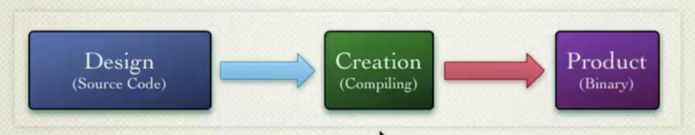

# Object-oriented Design

- it is the process of planning a system of interacting objects for the purpose of solving a software problem
  - It is one approach to software design
- usually changes always happen and something always changes
  - e.g.: clients did not know what they exactly wanted, or they told something wrong -　 therefore the need for software design is important
- applications that are easy to change are always fun to write and extend
  - Such applications will be flexible in development, adaptable to new requirements
- applications that lack such qualities as flexibility and adaptability
  - each change will be more expensive and more difficult

## Design Smells

- bad design smells
  - Rigidity
    - indicates that a system is rigid if it is difficult to change it, or even a small change will entail high costs
    - This suggests that the system is no longer flexible and extensible
  - Fragility
    - indicates that a system is fragile if a change in some part breaks something in another part
    - while the part in which something breaks is not connected in any way and does not explicitly depend on the part in which something has changed
  - Immobility
    - means that a system is immobile if certain parts of it cannot be separated into separate components or into separate modules and reused in another part of this system, and in the best cases, in other systems in general
  - Viscosity
    - The system is viscous if basic operations are difficult or take too long to complete and thus ignored
    - example of such operations that are difficult to modify and take a long time
      - slow tests
        - If they are hard to run, if they are hard to write
        - if they are slow to execute, then most likely no one will support them, no one will write them, no one will run them
  - Needless Complexity / premature optimization
    - indicates that the system is unnecessarily complicated or prematurely optimized
    - has too much code that is not currently used, but was written with the intention that it may be needed in the future if the customer wants that functionality
      - this generates dead code
      - code that is not used, first for days, then months, years, and then everyone forgets who wrote it, why it was written, and are simply afraid to delete it, because, it may be used somewhere, but nobody knows where
- the main reason for all the listed bad design smells is the lack of flexibility in the system
  - The system must be flexible, or, as per saying
    - software must be soft that is, it must be easy to change
  - that is why we need a good design

## What is Design?

- lifecycle
  - final product?
    – An application that solves some specific problems in its domain area
  - creation process?
    – The process of interpreting or compiling source code
  - design process
    - is the source code itself
- the design phase is much longer and more expensive than the creation phase
- the design phase should be iterative, gradual, with constant feedback from both the product and the client

## Why Change is Hard and the Problem Design Solves

- reason

  - Object-oriented application is made of parts – objects
  - Interactions are embodied in the messages that pass between the objects
  - Sender object – Target object creates dependencies between the two
  - Object-oriented design is about managing dependencies

- Change will always occur for requirements, product, ecosystem, environment, customer
  - The system needs a design that is ready for such changes
- the design would consist of certain parts that would interact with each other to create the behavior of something whole
  - a class, a component, an architectural layer, or an application
  - parts are objects, interactions between them are implemented using messages that are sent between these objects
  - sending the correct message to the correct recipient-object requires knowledge of where this object is and how to interact with it
    - This knowledge creates a relationship between two or three objects, or generally a huge number of objects in the system
    - Cross dependencies, cycle-dependency and so on arise
      - all these dependencies complicate system change
- Object-oriented design is essentially dependency management
- In the absence of design, unmanaged dependencies lead to chaos
  - because objects begin to know too much about each other, and at some point, it is easier to throw everything out and rewrite entire application than to add some next changes
  - Since these dependencies just become unmanageable
    - By changing something in one place, even if there are some tests, we do not exclude the possibility that something will not break in another place

## The Purpose of OOD

- Software must:
  - Satisfy customer's needs
  - Be flexible for change and enhancement
- the goal of object-oriented design is
  1. to satisfy the needs of the customer
  2. to be easy to change and be adaptable and ready for such changes and extensions

## The Tools of Design

- tools
  - Design Principles:
    - SOLID
    - DRY
    - KISS
  - Design Patterns
    - Creational
    - Behavioral
    - Structural
  - OOP Principles
    - Abstraction
    - Encapsulation
    - Polymorphism
    - Inheritance
