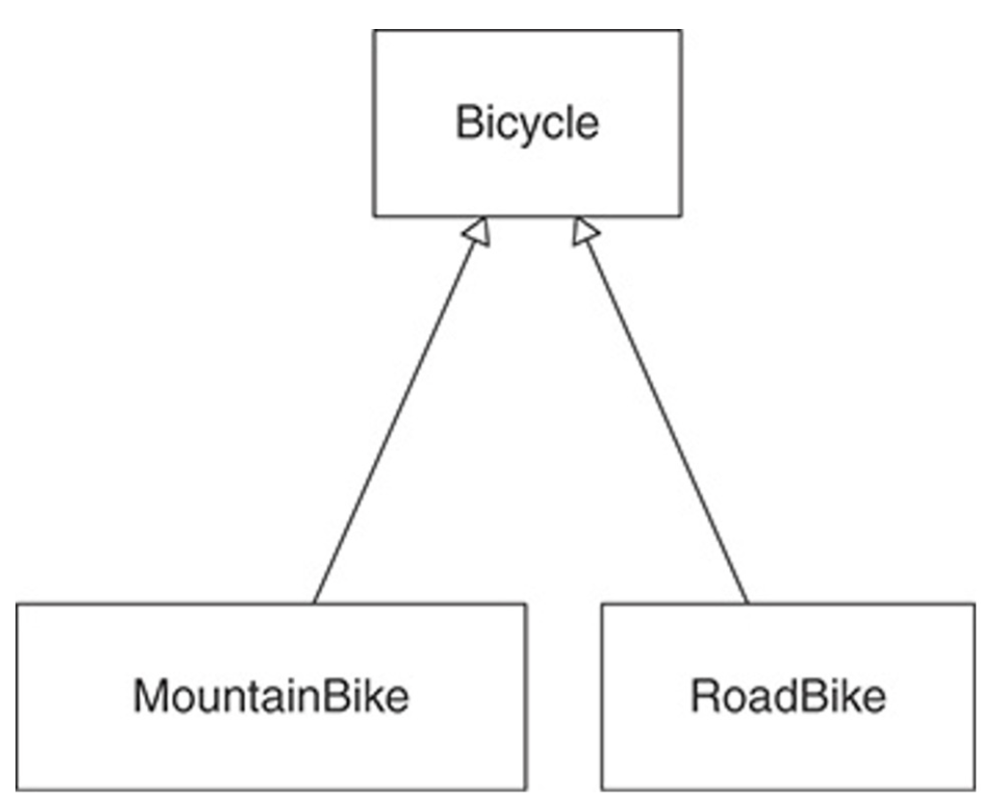

# Inheritance in Details

- JavaScript remains a prototype based, although the `class` keyword was introduced in `ES2015` but is a syntactical sugar
- Inheritance for JavaScript has only 1 construct `objects`
  - each object has a private property which holds a link to another object called `prototype`
  - that prototype object has a prototype of its own and so on until the object is reached with null as its prototype
    - by definition `null` has no prototype and acts as the final link in the prototype chain
- nearly all objects in JavaScript are instances of `Object` which sits on the top of a prototype chain
- the confusion is JavaScript's weakness
  - however, the prototypical inheritance model itself is more powerful than the classic model
    - e.g.: it is trivial to build a classic model on top of a prototypal model
- inheritance mechanisms play a key role in the object approach in terms of extensibility and reuse, model the relationship (`IS-A relationship`)
  - and exploit the relationship between the base class and its descendant
- Experienced developers can tell you that overuse of inheritance leads to code that is difficult to understand and maintain
  - This is primarily because the `IS-A relationship` is much stronger than the relationship that appears during composition
  - Therefore, when making changes, need to be very careful and see if any methods have been overridden, what is the contract of the parent class, at the level of coupling
- Inheritance is essentially an automatic message delegation mechanism
- Inheritance creates a relationship in which if one object cannot respond to a received message, it passes that message to another
  - this transfer happens automatically

## Recognizing Where to Use Inheritance

- problem

  ```ts
  class Bicycle {
    constructor(options) {
      // previous options
      this.style = options.style;
      this.frontShock = options.frontShock;
    }

    // becomes strange when a new style is added
    spares() {
      if (this.style === "road") {
        return {
          chain: "11-speed",
          tireSize: "28",
          tapeColor: this.tapeColor,
        };
      }

      return {
        chain: "11-speed",
        tireSize: "29",
        frontShock: this.frontShock,
      };
    }
  }

  const crossCountryBike = new Bicycle({
    style: "XC",
    size: "M",
    frontShock: "mountain",
  });
  const roadBike = new Bicycle({style: "road", size: "M", tapeColor: "red"});
  ```

## Creating an Abstract Superclass with Shared Abstract Behavior

- abstract class
  - can store both abstract and concrete methods
    - abstract methods must be implemented to use, concrete methods can be used without overriding them
  - all the abstract methods must be implemented in every non-abstract subclass
    - You always need to implement all the abstract methods and there should be no unused behavior in any subclass, if such thing happens this may be a sign of incorrect inheritance structure
  - stores the behavior which is common to all subclasses
    - subclasses inherited an abstract class should fully use its functionality, otherwise you need to review the inheritance structure



- solution: use Abstract class and inherit

  ```ts
  abstract class Bicycle {
    // keep only common parts
  }

  class RoadBike extends Bicycle {
    constructor(options) {
      super(options);

      this.tapeColor = options.tapeColor;
    }

    spares() {
      return {
        ...super.spares(),
        tapeColor: this.tapeColor,
      };
    }
  }

  class MountainBike extends Bicycle {
    constructor(options) {
      super(options);

      this.frontShock = options.frontShock;
    }

    spares() {
      return {
        ...super.spares(),
        frontShock: this.frontShock,
      };
    }
  }
  ```

- Abstract classes exist in order to inherit from them
  - They provide a common repository that stores the behavior common to all subclasses
  - each of them is a specialization of an abstract class
  - It almost never makes sense to create an abstract superclass with a single subclass

## Template Method Pattern: Default Implementation

- This gives subclasses the ability to inject specialization by overriding the default values set in the parent class
- This technique of describing the basic structure/algorithm in a superclass and redefining parts of this structure/algorithm to those that are already specific for a particular class is called the template method
- allows you to define the base algorithm in the superclass and control its lifecycle and then override only needed parts in the subclass

- solution: use Template method

  ```ts
  abstract class Bicycle {
    protected readonly defaultChain = "11-speed";

    constructor(opts) {
      // ...
      this.chain = opts.chain || this.defaultChain;
      this.tireSize = opts.tireSize || this.defaultTireSize;
    }
  }

  class RoadBike extends Bicycle {
    protected readonly defaultTireSize = "28";
  }

  class MountainBike extends Bicycle {
    protected readonly defaultTireSize = "29";
  }
  ```

- now there are new problems:
  - Mountain bike and road bike classes depend on their abstract class
  - Abstract class depends on children
  - If you forget to call super methods – the result might not contain all data required
  - Users of road and mountain bike depend on the abstract class, even if they don't know anything about it

## Using Hook Messages: Decoupling Subclasses

- This strategy removes the knowledge of the algorithm from the subclass and returns control to the superclass

  - Which was done by adding the postInitialize method

- solution: Using Hook Messages

  ```ts
  abstract class Bicycle {
    constructor(opts) {
      this.size = opts.size;
      this.chain = opts.chain;
      this.tireSize = opts.tireSize;

      this.postInitialize(opts);
    }

    protected postInitialize() {}

    spares() {
      return {
        tireSize: this.tireSize,
        chain: this.chain,
        ...this.localSpares(),
      };
    }
  }

  class RoadBike extends Bicycle {
    protected postInitialize(opts) {
      this.tapeColor = opts.tapeColor;
    }

    protected localSpares() {
      return {tapeColor: this.tapeColor};
    }
  }

  class MountainBike extends Bicycle {
    protected postInitialize(opts) {
      this.frontShock = opts.frontShock;
    }

    protected localSpares() {
      return {frontShock: this.frontShock};
    }
  }
  ```

- RoadBike and MountainBike no longer control the initialization process
  - but instead bring specialization to a more abstract algorithm
  - This algorithm is defined in the abstract superclass Bicycle, which in turn is responsible for sending postInitialize
  - To achieve this result Bicycle constructor should always be called, this will happen automatically if derived classes will have no constructor
- This same technique can be used to remove the dispatch of super in the spares method

## Summary

- Inheritance solves the problem of related types that share a great deal of common behavior but differ across some dimension
- The best way to create an abstract superclass is by pushing code up from concrete subclasses
- Abstract superclasses use the template method pattern to invite inheritors to supply specializations
  - they use hook methods to allow these inheritors to contribute these specializations without being forced to send super
- Well-designed inheritance hierarchies are easy to extend with new subclasses, even for programmers who know very little about the application
- what is the disadvantage of multiple inheritance
  - ambiguity can arise
    - this will allow you to decouple parent classes from each other and use only the functionality you need
    - with this inheritance scheme, ambiguity can arise
