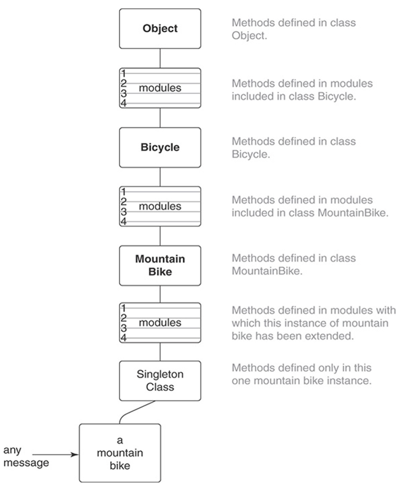
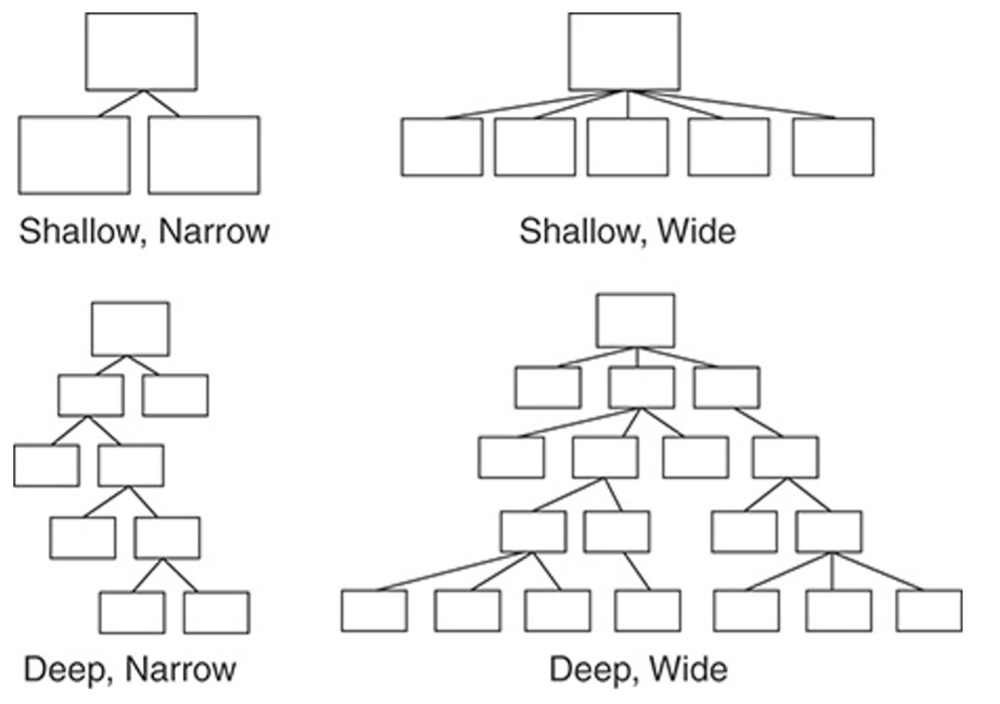

# Mixins

- Mixins is another OOD tool to share some behavior between non-related objects
  - while inheritance and composition working with some classes' hierarchy mixins can share needed behavior between different classes which are not directly related but need to play some specific role
- mixins model relation type: `BEHAVES-AS`
  - mixins tells us that some object under some circumstances 'behaves-as' needed under these circumstances
- inheritance is not the only way to share a behavior
  - every problem which we solve using inheritance can also be solved using other tools, such as mixins

## Understanding Roles

- Sometimes you need to share some behavior between non-related objects

  - such case is a direct opposite to inheritance hierarchy (IS-A relation)
  - It is rather a role, which object can play on some state of its lifecycle

- example
  - When you need to use mixin functionality on some object, you can just add it to the object's prototype
    - this will give us the possibility to use mixins methods on this object
  - such approach has some consequences, prototypes functionality is not the most convenient in usage, apart from that, `Object.assign()` only makes a shallow copy
    - can use existing JavaScript libraries to make mixins usage easier

```ts
const sayMixin = {
  say(phrase) {
    alert(phrase);
  },
};

const sayHiMixin = {
  __proto__: sayMixin,
  sayHi() {
    super.say(`Hello ${this.name}`);
  },
  sayBye() {
    super.say(`Bye ${this.name}`);
  },
};

class User {
  constructor(public name) {}
}

Object.assign(User.prototype, sayHiMixin);

new User("Dave").sayHi();
```

## Writing the Concrete Code

- example 1

  - major part of logic is stored in Schedule class
    - the class is used in isSchedulable method of Bicycle
      - it needs two dates, one for the start and one for the end of booking
      - Schedule instance receives start date with subtracted leadDays
        - so as to provide enough time to prepare the bicycle for a trip
  - we can schedule a bicycle, but we also have other classes like Mechanic and Driver and each of them has its own leadDays value
    - by extracting common logic, we can create Schedulable duck type
  - with the new Schedulable instance, the relation between Bicycle and Schedulable is not `IS-A`
    - because Bicycle should not be schedulable under normal conditions
    - This duck type describes Bicycle specific behavior when it is required to be scheduled for the trip
    - Other parts of the system should not even know that Bicycle is schedulable
  - these classes relations will be better to describe as `BEHAVES-AS`

  ```ts
  class Schedule {
    isScheduled(schedulable, starting, ending) {
      console.log(
        `Checking if ${schedulable.constructor.name}` +
          `is available on ${starting} - ${ending}`
      );

      //do the checks

      return true;
    }
  }

  class Bicycle {
    leadDays = 1;

    constructor(parts, schedule = new Schedule()) {
      this.schedule = schedule;
      // ...
    }

    isSchedulable(starting, ending) {
      const withLeadTime = starting - this.leadDays;

      return this.schedule.isScheduled(this, withLeadTime, ending);
    }
  }
  ```

- example 2

  - by extracting common logic to SchedulableMixin with isSchedulable method
    - now we can easily mix it to any class in the hierarchy, either Bicycle, Mechanic or Driver, so we will have schedulable behavior when we only need it
    - In this case decorators could be used as an alternative solution
    - The only consequence in Schedulable mixin is that we need to store leadDays property in a target class, so it can be used in mixin

  ```ts
  const SchedulableMixin = (superclass) =>
    class extends superclass {
      private _schedule: Schedule;
      protected leadDays = 0;

      set schedule(schedule) {
        this._schedule = schedule;
      }

      get schedule() {
        return this._schedule || new Schedule();
      }

      isSchedulable(starting, ending) {
        const withLeadDays = starting - this.leadDays;

        return this.schedule.isScheduled(this, withLeadDays, ending);
      }
    };

  class Bicycle extends SchedulableMixin(Object) {
    protected leadDays = 1;
  }

  class Vehicle extends SchedulableMixin(Object) {
    protected leadDays = 3;
  }

  class Mechanic extends SchedulableMixin(Object) {
    protected leadDays = 4;
  }
  ```

## Writing Inheritable Code



- mixins adds additional levels to the call stack
  - this makes understanding and debugging of the application less obvious
  - thus need to keep this in mind and use mixins only when they are really needed
- rules to follow

  - `Recognize the Antipatterns`
    - There are two antipatterns which may indicate that you can gain a benefit from inheritance
    - First of them is using variables with a type/category to determine a type of object and send it a message
    - The second is usage of direct object type checking or switch-case operator
      - rather missed a duck type
      - Duck types may have not only common interface but also common behavior, which is recommended to extract to mixins
  - `Insist on the Abstraction`
    - All the code in an abstract superclass which should be used in every subclass, superclasses should not contain a code which is only applied for some subclasses
    - This limitation is also applicable to mixins, all the mixin functionality should be used in every place where it is mixed in
    - If you cannot identify an abstraction, then probably it is not existing, and inheritance cannot be applied to solve this problem
  - `Honor the Contract`
    - Subclasses must honor the contract, so they can be easily replaced with superclasses without any change in a system behavior
    - This means that they need to answer on the same messages receiving the same input data and returning the same result data
    - Thereby they cannot do something which will force a client code to check them for a type to understand what to wait from them
    - Subclasses which do not honor the contract cannot work synchronously thus making all the inheritance hierarchy unpredictable
    - This also violates Liskov Substitution Principle
  - `Preemptively Decouple Classes`
    - Try to avoid super method call, use template method pattern and so-called hooks instead, they give subclass a possibility to specify the common algorithm which is controlled by superclass
    - Remember that it is not a "silver bullet" and do not follow this approach blindly
  - `Create Shallow Hierarchies`
    - Try to create as compact hierarchies as it is possible
    - Shallow hierarchies are easy to understand, shallow and wide are slightly more difficult, but they still are easy to understand
    - Deep and narrow hierarchies tend to become wider and much difficult to understand and maintain
    - You should avoid deep and wide hierarchies, they create a long path to target method or property which is missing in a target class
    - Such hierarchies are difficult to maintain, and they create a high risk of application failure

  
