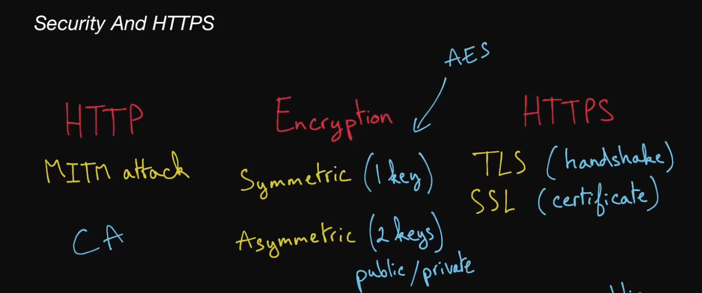
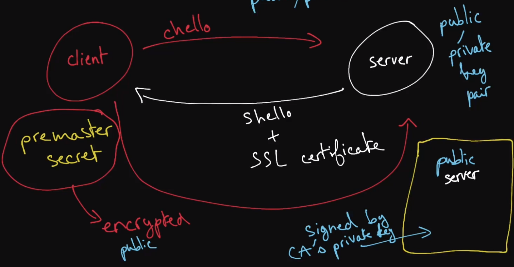

# Security and HTTPS

## Man-In-The-Middle Attack (MITM)
- an attack in which the attacker intercepts a line of communication that is thought to be private by its 2 communicating parties
- if a malicious actor intercepted and mutated an IP packet on its way from a client to a server, that would be a man-in-the-middle attack
- MITM attacks are the primary threat that encryption and HTTPS aim to defend against
## Symmetric Encryption
- a type of encryption that relies on only a single key to both encrypt and decrypt data
- the key must be known to all parties involved in communication and must be shared between parties at 1 point or another
- Symmetric-key algorithms tend to be faster than their asymmetric counterparts
- the most widely used symmetric-key algorithms are part of the Advanced Encryption Standard (AES)
- Symmetric encryption by itself would not solve the HTTP vulnerability
  - this is because sharing of common key between the client and server requires it to be shared over a security communications channel
    - otherwise it will still be vulnerable to MITM attack
## Asymmetric Encryption
- also known as public-key encryption, it relies on 2 keys
  - a public key and private key to encrypt and decrypt data
- the keys are generated using cryptographic algorithms and are mathematically connected such that data encrypted with the public key can only be decrypted with the private key
- while the private key must be kept secure to maintain the fidelity of this encryption paradigm, the public key can be openly shared
- asymmetric-key algorithms tend to be slower than their symmetric counterparts
## Advanced Encryption Standard (AES)
- is a widely used encryption standard that has 3 symmetric-key algorithms
  - AES-128, AES-192, AES-256
- AES is considered to be the "gold standard" in encryption and is even used by the US National Security Agency to encrypt top secret information
## HyperText Transfer Protocol Secure (HTTPS)
- it is an extension of HTTP that's used for secure communication online
- it requires servers to have trusted certificates (usually SSL certificates)
  - uses the Transport Layer Security (TLS), a security protocol built on top of Transmission Control Protocol (TCP)
    - to encrypt data communicated between a client and a server
## Transport Layer Security (TLS)
- is a security protocol over which HTTP runs in order to achieve secure communication online
- HTTP over TLS is also known as HTTPS
## Secure Sockets Layer (SSL) Certificate
- is a digital certificate granted to a server by a certificate authority
- contains the server's public key, to be used as part of the TLS handshake process in HTTPS connection
- an SSL certificate effectively confirms that a public key belongs to the server claiming it belongs to them
- SSL certificates are a crucial defense against mam-in-the-middle attacks
## Certificate Authority
- a trusted entity that signs digital certificates
  - namely SSL certificates that are relied on in HTTPS connections
## TLS Handshake
- the process through which a client and a server communicating over HTTPS exchange encryption related information and establish a secure communication
- the typical steps in a TLS handshake are roughly as follows
  - the client sends a client hello "a string of random bytes" to the server
  - the server responds with a server hello "another string of random bytes" as well as its SSL certificate, which contains its public key
  - the client verifies that the certificate was issued by a certificate authority and sends a premaster secret yet another string of random bytes,
    - this time encrypted with the server's public key to the server
  - the client and the server use the client hello, the server hello, and the premaster secret to then generate same symmetric-encryption session keys
    - to be used to encrypt and decrypt all data communicated during the remainder of the connection

