# Java 9
- JPMS (Java Platform Module System) also known as Project Jigsaw
  - benefits
    - modularity as a first class citizen
    - designing for modularity early
    - new concepts, syntax, and tools
    - modular platform
    - smaller footprint
- 5 pillars of modularity
  - Encapulated: stronger encapsulation
    - protection of a module's internals
  - Interoperable: reliable modularity
    - working with other modules
  - Composable: reliable modularity
    - modules can be combined with other modules
  - Expandable: reliable modularity
    - modules can be scaled up
  - Autonomous: decomposable
    - modules work independently of other modules
## What it is trying to solve
### Java 8
- limited in terms of expressing modularity beyond a single package
- once a class is public, there is no further way to control which classes in other packages can see it
  - its all or nothing
- path of the class that is stored on disk is intertwined with the package hierarchy
  - means that how you organize the package hierarchies must be aligned with the accessibility that you want to assign to your class
- example
  - 1 package example works fine
    - all packages are inside the movement package
    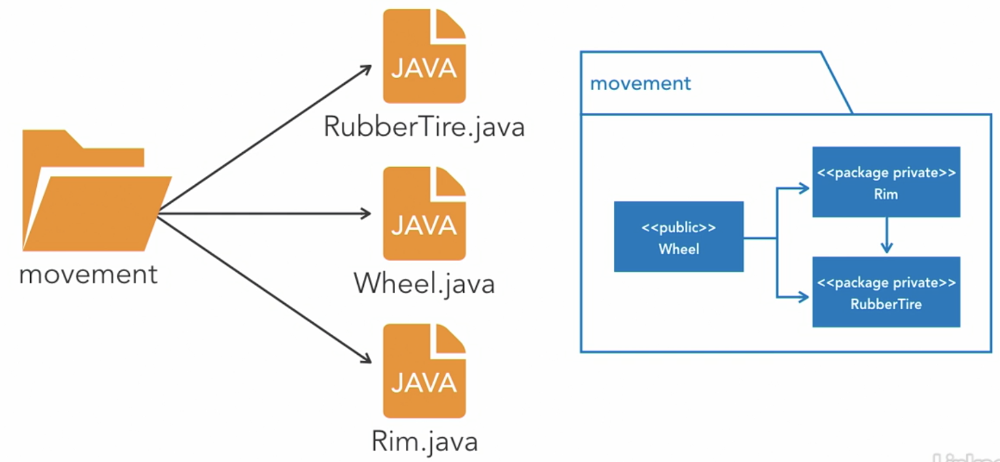
  - multiple packages example will not compile
    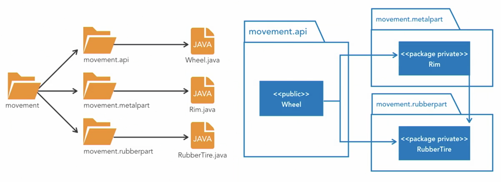

### Java 9 improvements
- class ccessibility
  - JPMS offers better controls to expose classes
- classpath hell
  - JPMS maintains class integrity
  - can be verified by static analysis
  - support for versioning
  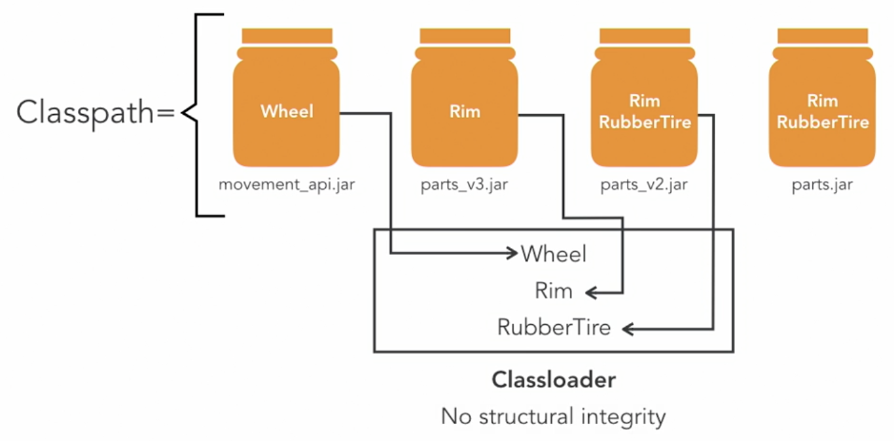
  
- controlling the system footprint
  - a large chunk of the JDK libraries were delivered as 1 big JAR file `rt.jar`
  - by java 8, it had grown to over 66 MB of line code
  - typical apps will not use all 66 MB, so why make all of it available at runtime
  - thus the `rt.jar` has been modularized
    - libraries that used to eist in `rt.jar` have now been segmented into smaller `JMOD` files
      - a new file format to package modules
## Module-info
- Regular java class
- Module-related syntax only
- module meta-data available at runtime
- providing fidelity across phrases
- 1 module-info per module
- declared at the root of module
- mandatory for JPMS
- creates a namespace for the module
- must be globally unique, like package names
- no duplication
- modules dictate how packages are stored on file system
- module hierarchies must match filesystem hierarchies
- segregated package hierarchies
- modules could each have their own codebase and lifecycles, but is not a must
- filename `module-info.java`
  ```java
  module module.name {                                 // 1
    exports package.name.a;                            // 2
    exports package.name.b to other.module.name.a;     // 3
    requires other.module.name.b;                      // 4
  }
  ```
### Module name
- first line contains module keyword followed by module name
  - `module.name` in given example
- Module naming convention is similar to package convention
  - reversed domain notation: domainName.module
    - domain name: organization.com
    - module: project
    - module name in module-info: `com.organization.project`
### Module API
- The second line declares that classes from a `package.name.a` may be accessible for other modules
- Module descriptor can export multiple packages, each on a separate line
### Restricted API
- Line #3 declares that package `package.name.b` is accessible only for `other.module.name.a`
- This functionality should be use carefully, it brakes the rule that module knows only depended modules
- It also increases coupling of modules
### Module dependency
- In the last line contains the information about the module dependencies
- In the provided example the `module module.name` depends on `other.module.name.b` module and has access to its exported packages
- dependencies are enforced at run time
- apps fail if they can't resolve all of their dependencies
## Transitive dependencies
- a transfer of dependencies to dependent modules
  - in simpler terms
    - every package a given module requires gets automatically passed to dependent modules
- it keep dependency graphs coherent
- it is a clean way to transfer dependencies to dependent modules
  - but avoid having to repeat the dependency requirements
```java
module module.name {                                   
  requires transitive other.module.name.b;  // add transitive key word
}
```
- from
  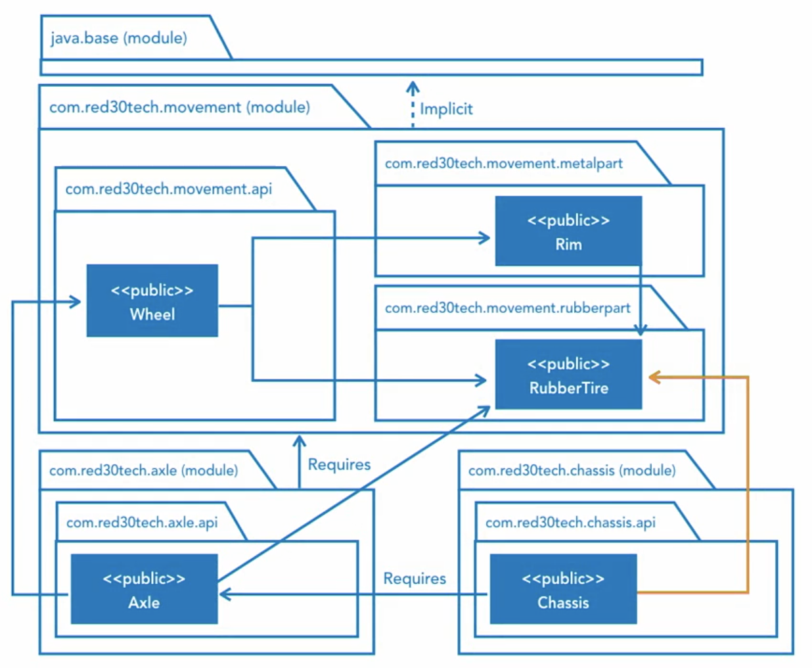
- to
  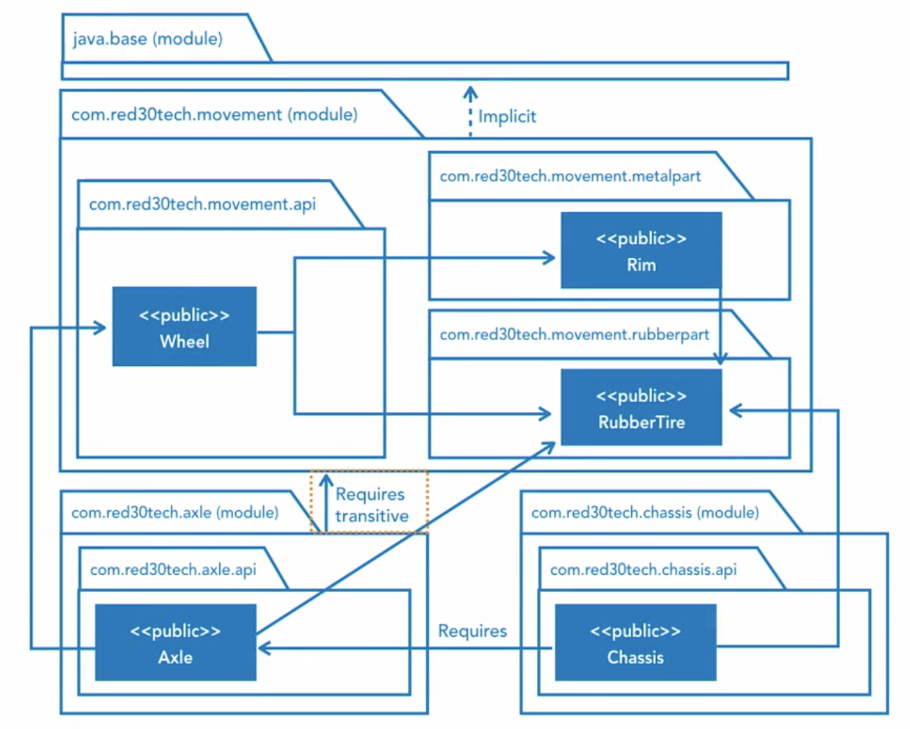

## Qualified dependencies
- exporting of packages to chosen modules
  - similar to white listing approach to exporting
- allow the exporting module to choose which foreign modules are allowed to read it
- acts as a fine-grained filter, giving individual access at the package level
- drawbacks of using qualified dependencies
  - exporting modules should normally not know about which other modules are depending upon them
  - qualified exports break this rule
  - it should only be used in friend like contexts
  - it is used because the modules are working closely with other modules to provide a functionality
  - funcationalities are structured into independent modules
    - but federated to act as 1 in providing that functionality
- limitations to qualified dependencies
  - it can't be used to grant readability to all forieng modules because they would all need to be known
  - foreign modules must already exist, if not compilation will fail
- qualified exporting should not be used as the default exporting tool
  - but should be instead be used in special circumstances
  - best used to give fine-grained access to known modules working together
- problem
  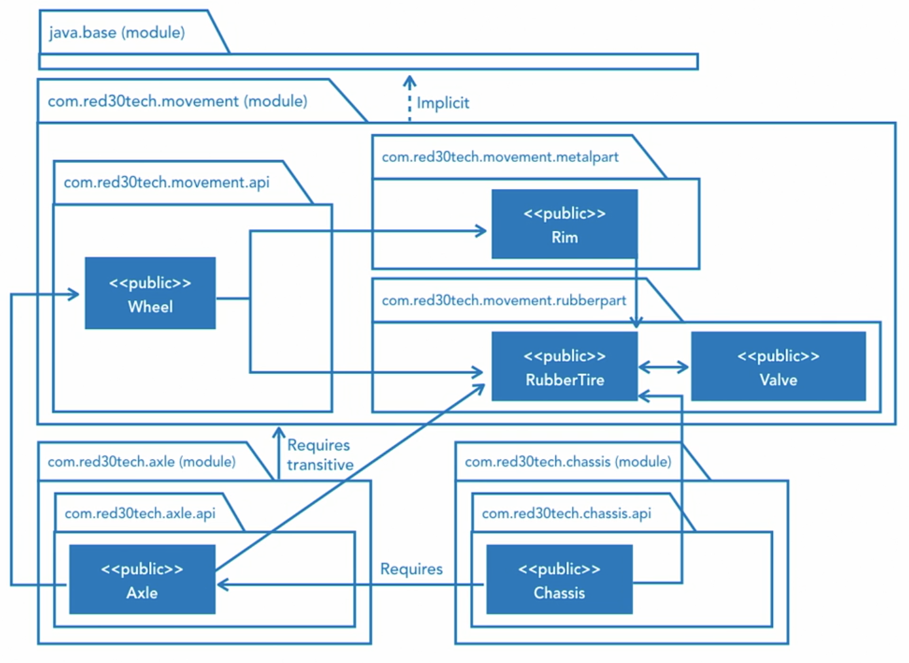

- solution 1: changing accessibility from public to package private
  - works if dependency does not require access from anywhere else
  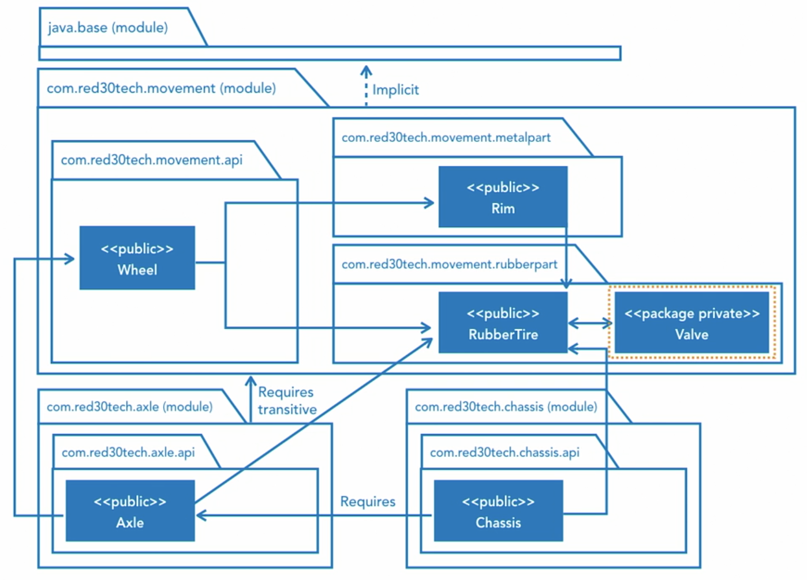

- solution 2: refactor code
  - is a hacky solution
  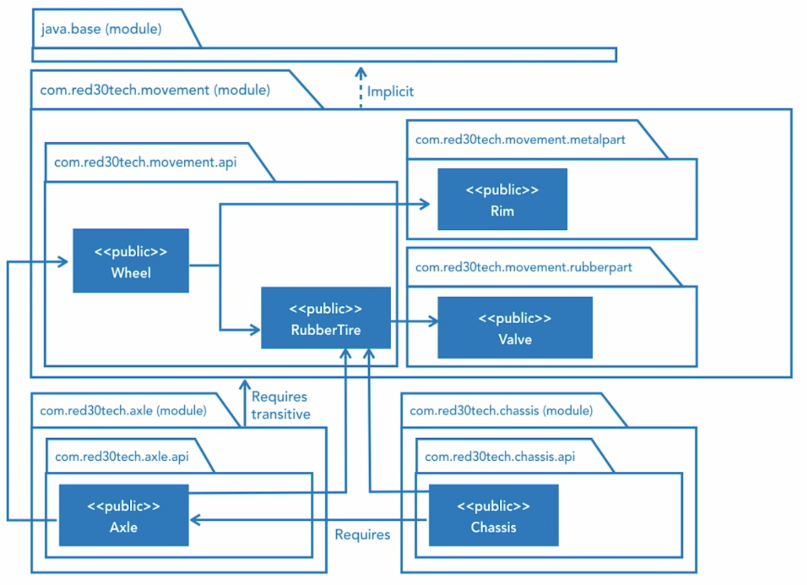

- Proper solution:
  - change accessibility from public to package private
  - use the `to` key word in `module-info.java` file
  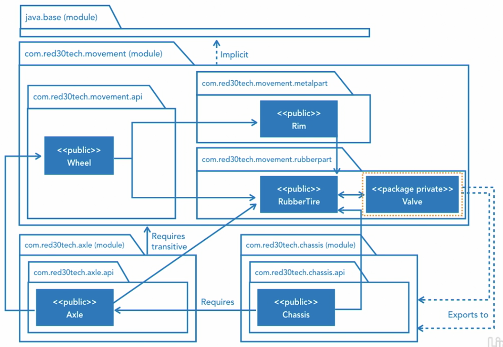

```java
module module.name {                                 
  exports package.name.b to other.module.name.a, other.module.name.c, ...;  // use the to key, can export to multiple packages
}
```
## Service dependencies
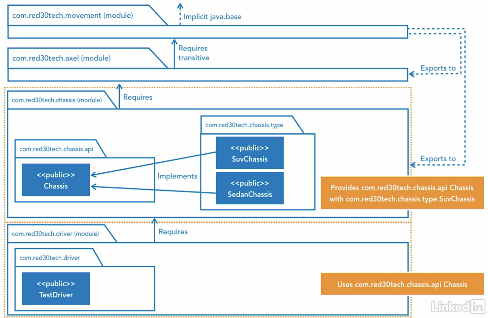

- service provider
  - has an interface where multiple types implements it
  - in the `module-info.java` file
    ```java
    module module.name {
      exports package.name.a;;
      provides package.name.a.InterfaceName with  // interface
               package.name.a.type.One;           // class that implements interface
               package.name.a.type.Two;           // can provide multiple classes that implements the interface
               ...
    }
    ```
- service consumer
  ```java
  module module.name.b {
    requires package.name.a;
    uses package.name.a.InterfaceName;  // only interface is specified
  }
  ```
  - service loader
    - pluggable services framework
    - binds service providers to consumers
    - not new, but enhanced for JPMS
    - does not replace dependency injection frameworks
      - but can be used in apps that need to deliver functionality in a modular and interoperable way without using third party frameworks
      - ideal for stand-alone jave SE apps
    - example: a class that uses the service loader to obtain an instance to one of the interface implementations
    ```java
    import java.util.ServiceLoader;
    import java.util.Optional;
    import com.red30tech.chassis.api.InterfaceName;
    ```
    ```java
    ServiceLoader<InterfaceName> serviceLoader = ServiceLoader.load(InterfaceName.class);

    System.out.println("Found " + serviceLoader.stream().count() + " interface name configured");  // count depends on number of classes implemented with interface that are provided in the modular-info.java file

    Optional<InterfaceName> optional = serviceLoader.findFirst();
    optional.orElseThrow(() -> new RuntimeException("No service providers found"));
    InterfaceName interfaceName = optional.get();
    ```
## Optional dependencies
- mandatory at compilation time, but optional at run time
- the interface can now add an option to enable or disable the implementation of the optional dependencies
- optional dependencies must be coded defensively
  - must use with `try/catch` and with `NoClassDefFoundError` exception
- optinal modules become regular modules if they get required by other modules in the graph
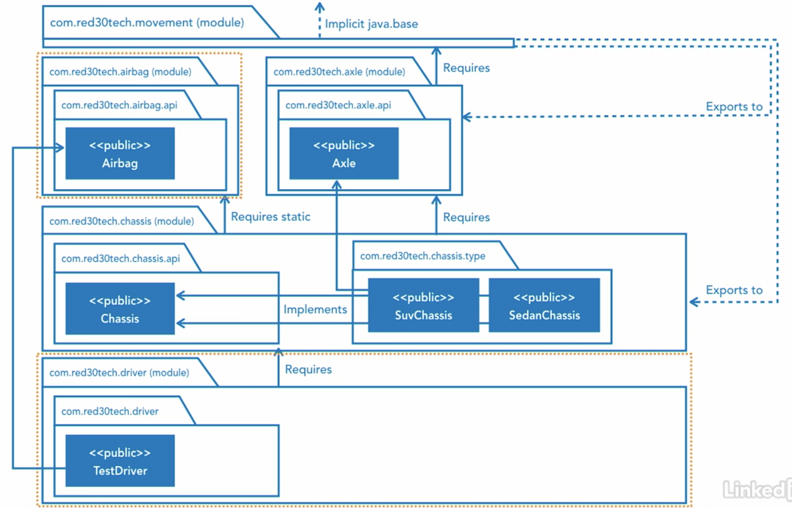

```java
moduel module.name {
  requires package.name.b;
  requires static package.name.c;  // use the static keyword to make it optional
  exports package.name.a;
  provides package.name.a.InterfaceName with
           package.name.a.type.One;           
           package.name.a.type.Two;
}
```
```java
try {
  OptionalDependencyName a = new OptionalDependencyName();
} catch (NoClassDefFoundError exception) {
  a = null;
}
```
```bash
# run without optional dependency
java --module-path mods/ -m com.domain.module/com.domain.module.Main

# run with optional dependency
java --module-path mods/ --add-modules com.domain.optionalmodule -m com.domain.module/com.domain.module.Main
```
## Runtime dependencies
- API misuses are caught at compilation time
  - by not exporting the package
    - the package won't be readable by foreign modules
- if a dependency was not exported
  - importing or instantiating the dependency will cause a compilation error
  - reflection-based framework
    - not importing but using the type without instantiating will allow compilation but fails at runtime
### Open dependencies
- allows module access at run time only (via reflection)
- compile time access is closed
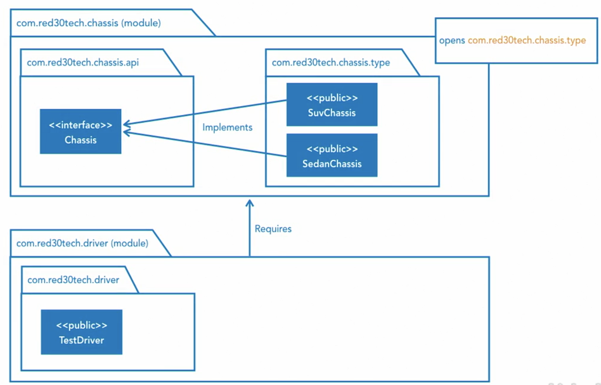

```java
moduel module.name {
  requires package.name.b;
  requires static package.name.c;
  exports package.name.a;
  opens package.name.a.type;  // use the opens keyword to allow reflection-based access at run time to all classes
  provides package.name.a.InterfaceName with
           package.name.a.type.One;           
           package.name.a.type.Two;
}
```
## Rules of modularization
- Firstly
  - cycles between modules (on compilation level) are prohibited
  - It’s a limitation but no one should cry because of that
  - Cycles in general are sign of a bad design
- Secondly, even if module encapsulation is controlled on compile and runtime level
  - you can brake it using reflection API and freely use debug tools
- Thirdly, all modules have an implicit dependency to `java.base` module and it doesn’t have to be specified in module descriptor
  - The implicit dependency on `java.base` is similar to implicit import of `java.lang.String` class
- Fourthly, due to backward compatibility, every class not placed in the modules goes to unnamed module
  - That module has dependency to all other modules and has access to the packages which they exported
  - It’s important that not exported packages are not accessible
  - Since Java 9 some APIs are marked as internal and are unavailable from regular packages
  - If you compile code using such packages in Java 8 and try to use it with Java 9, you’ll get runtime error
## Modular structure design
- small apps may have just 1 module
### JPMS introduces the module path
- it tells the compiler and runtime where to find the modules
- directory hierarchy must match module/package hierarchy
  - each module is a separate hierarchy
- the module path supersedes the class path
  - the class path is for backward compatibility
- the module path can aggregate many modules
  - each module can be its own island of code
- 1 modular structure
  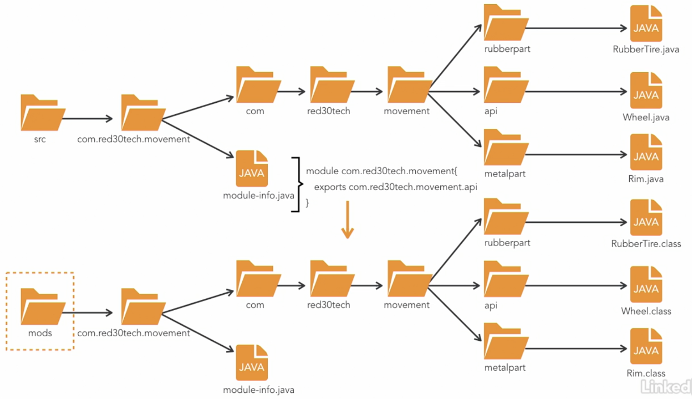

- multi modular structure
  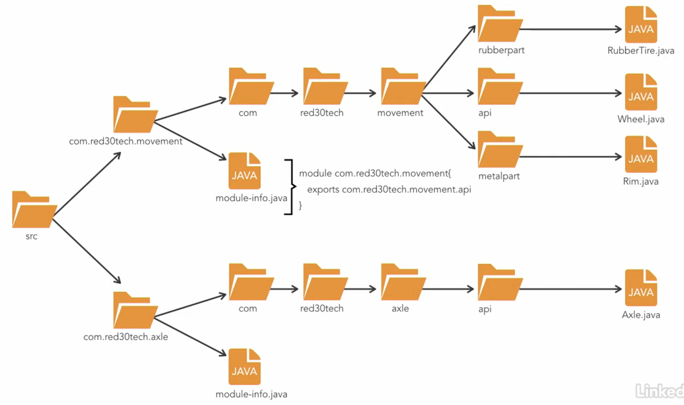
## Tools and Strategies
### javac
- `javac -d ./mods/ --module-source-path src $(find src -name "*.java")`
- `javac -d ./mods/ --module com.domain.module --module-source-path src`
- `javac -d ./mods/ --module-path mods --module com.domain.module --module-source-path src`
- build with version
  > `javac -d ./mods/ --module-source-path src --module-version 123.01 $(find src -name "*.java")`
### Jar
- a jar file that contains module-info at its root
- a module is 1 to 1 with a jar file
- build
  ```bash
  rm -rf bin
  mkdir bin

  javac -d ./mods/ --module-source-path src $(find src -name "*.java")
  find src -name "*.java"

  jar --create --file ./bin/com.domain.modulea.jar -C mods/com.domain.modulea .
  jar --create --file ./bin/com.domain.moduleb.jar -C mods/com.domain.moduleb .
  ```
- build with versioning
  ```bash
  rm -rf bin
  mkdir bin

  javac -d ./mods/ --module-source-path src $(find src -name "*.java")
  find src -name "*.java"

  jar --create --file ./bin/com.domain.modulea.jar --module-version=123.02 -C mods/com.domain.modulea .
  jar --create --file ./bin/com.domain.moduleb.jar -C mods/com.domain.moduleb .
  ```
- run
  > java --module-path bin -m com.domain.modulea/com.domain.modulea.ClassName
### Dependency checking tools
- describe module
  - describe modules used and their dependencies without running the program
  > java --module-path mods/ --describe-module com.domain.modulea
- list modules
  - list all of the observable modules
    - observable modules are modules that are available at run time
    - but not necessarily the ones used by the application
  > java --module-path mods/ --list-modules com.domain.modulea
- show module resolution
  - shows how modules are resolved before running the application
  - will include both the JDK library modules and the application modules
  - will also run the application
  > java --module-path mods/ --show-module-resolution -m com.domain.modulea/com.domain.modulea.ClassName
- dry run
  - to make sure application will resolve all dependencies without actually running the app
  - an error will occur if module does not exist
  > java --module-path mods/ --dry-run -m com.domain.modulea/com.domain.modulea.ClassName
- upgrade version at run time
  - build first version
    > javac -d ./mods/ --module-version 123.01 --module-source-path src $(find src -name "*.java")
  - build second version
    > javac -d ./mods2/ --module-version 123.02 --module com.domain.modulea --module-source-path src
  - run with upgraded version
    > java --upgrade-module-path mods2 --module-path mods -m com.domain.modulea/com.domain.modulea.ClassName
#### Jdeps
- a class dependency analyzer tool
- check dependencies
  - prints the dependencies between each module
  > jdeps --module-path mods/ mods/com.domain.modulea
- list jdeps
  - print a summarized list of dependencies
  > jdeps --list-deps --module-path mods/ mods/com.domain.modulea
### Module packaging tools
#### Jmod
- a tool and a file format
- it creates jmod files
- similar in intent as jar files, but designed to work with `Jlink`
- used to build custom runtime images
- pre-java9
  - 1 jar file as `rt.jar` contains all JDK libraries
  - causes longer time to start
  - not suitable for small apps with very short lifecycle
- build jmods
  ```
  rm -rf jmods jlink
  mkdir jmods

  javac -d ./mods/ --module-source-path src $(find src -name "*.java")

  jmod create jmods/com.domain.modulea.jmod --class-path mods/com.domain.modulea
  jmod create jmods/com.domain.moduleb.jmod --class-path mods/com.domain.moduleb
  ```
- list jmod contents
  > jmod list jmods/com.domain.modulea.jmod
- describe jmod contents
  > jmod describe jmods/com.domain.modulea.jmod
- extract classes from jmod contents
  > jmod extract jmods/com.domain.modulea.jmod
### Custom image building tools
#### Jlink
- a tool to create custom runtime images
- self-contained images that include the JRE
- it contains everything needed to run, no pre-installing of Java Runtime on the host is required
- it strips away everything from the JDK that isn't used by the app
  - results in a smaller overall app distribution
- build jlink from jmod
  ```
  rm -rf jmods jlink
  mkdir jmods

  javac -d ./mods/ --module-source-path src $(find src -name "*.java")

  jmod create jmods/com.domain.modulea.jmod --class-path mods/com.domain.modulea
  jmod create jmods/com.domain.moduleb.jmod --class-path mods/com.domain.moduleb
  
  jlink --module-path $JAVA_HOME/jmods:jmods --add-modules com.domain.modulea --output jlink --launcher run=com.domain.modulea/com.domain.modulea.ClassName
  ```
- run jlink
  > jlink/bin/run
#### Jmod hasing
- a hash is a tag that marks interrelated Jmod files ensuring they are used together
- it prevents files from different tags to be interchanged
- hash jmod
  ```
  rm -rf jmods jlink
  mkdir jmods

  javac -d ./mods/ --module-source-path src $(find src -name "*.java")

  jmod create jmods/com.domain.modulea.jmod --class-path mods/com.domain.modulea
  jmod create jmods/com.domain.moduleb.jmod --class-path mods/com.domain.moduleb
  
  jmod hash --module-path jmods --hash-modules .*
  
  jlink --module-path $JAVA_HOME/jmods:jmods --add-modules com.domain.modulea --output jlink --launcher run=com.domain.modulea/com.domain.modulea.ClassName
  ```
- view hash with describe
  > jmod describe jmods/com.domain.modulea.jmod
#### Jar files vs Jmod files
|jar files|jmod files|
|-|-|
|support modules|use for custom run time image|
|use for running on a pre-installed JRE|can hold native libraries|
||use for packaging on custom images|
