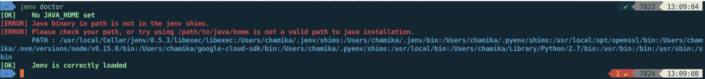

# Java Version Manager - jEnv
## Install
> brew install jenv
## Configuration
- Add following configs into ```~/.bash_profile``` or ```~/.bashrc``` or ```~/.zshrc```
```
export PATH="$HOME/.jenv/bin:$PATH"
eval "$(jenv init -)"
```
- restart shell
  - if using zsh ```source ~/.zshrc```
## Verify installation
- ```jenv doctor```
  - during the first initial setup, it is normal to have the following, it means jenv is correctly loaded
    
## Run the following if using ```maven (mvn)```
- ensure that JAVA_HOME is correct ```jenv enable-plugin export```
- make Maven aware of the java version in use & switch when project does ```jenv enable-plugin maven```
## Install different JDK versions
- Install latest
  - ```brew install openjdk```
- Install Java 8
  - `brew install AdoptOpenJDK/openjdk/adoptopenjdk8`
- Install Java 9
  - `brew install AdoptOpenJDK/openjdk/adoptopenjdk9`
- Install Java 10
  - `brew install AdoptOpenJDK/openjdk/adoptopenjdk10`
- Install Java 11
  - `brew install AdoptOpenJDK/openjdk/adoptopenjdk11`
## Configure JDK versions with jEnv
- list all java versions installed ```/usr/libexec/java_home -V```
  - if installed java version path is not listed, find the path, then add it with the same method below
- Add JDK path ```jenv add <your_jdk_path>```
  - e.g.: ```jenv add /Library/Java/JavaVirtualMachines/openjdk-14.0.1.jdk/Contents/Home```
## List all java versions jEnv is managing
- ```jenv versions```
## Set system wide java version
- ```jenv global 14.0```
## Set project wide java version
- ```jenv local 11```
- this will create a ```.java-version``` file inside the current folder
## Set shell instance java version (not required)
- ```jenv shell openjdk64-1.8.0.252```
## Check current java version being used
- ```java -version```
