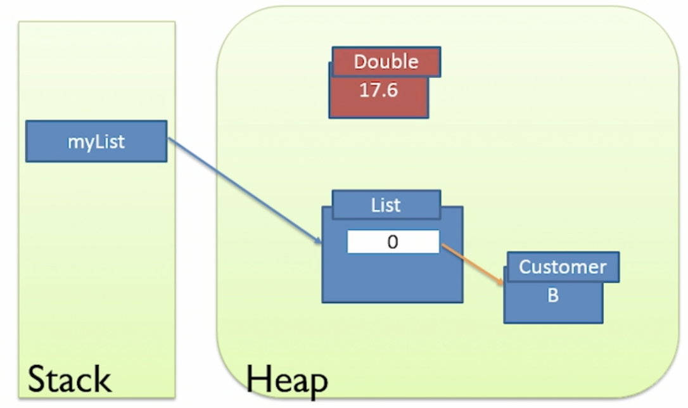
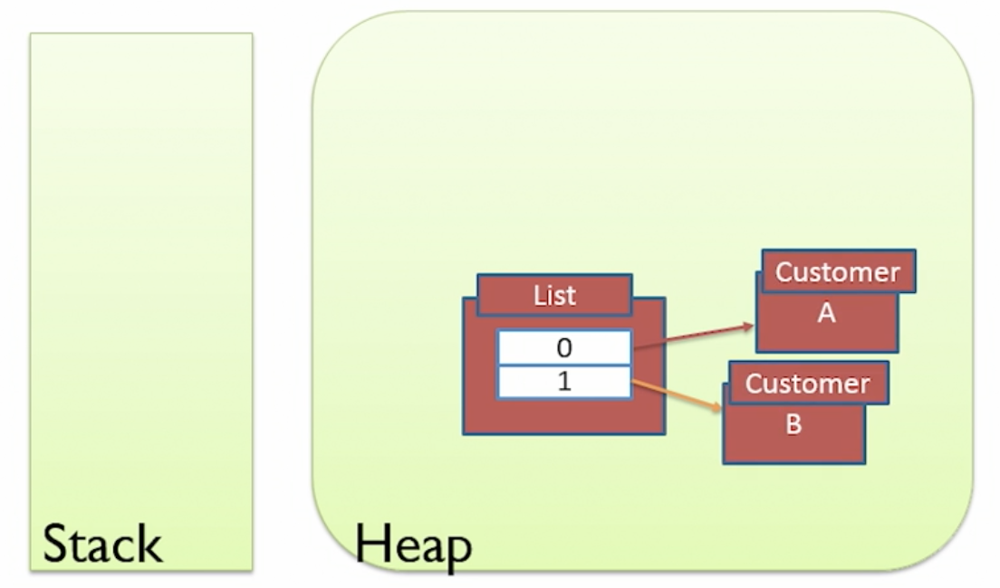
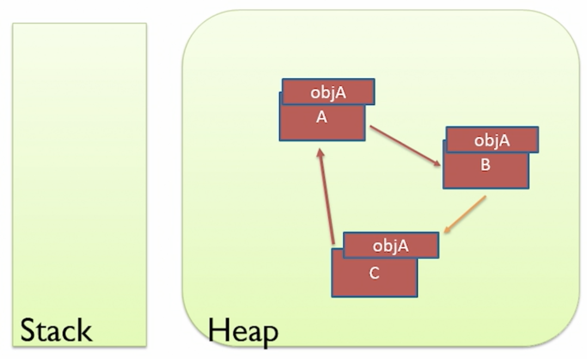

# Memory Management
## Java Memory
- when app run, need access to some of computer's memory to store the objects that we create and hold in memory
- rules
  - objects are stored on the heap
  - variables are a reference to the object which is stored on the stack
  - local variables are stored on the stack
### The Stack
- every thread has its own stack
- it is managed by the Java Virtual Machine (JVM)
- java knows exactly when data on the stack can be destoryed
- used for local primitive variables
  - e.g.: ints and doubles
- stack works as First In Last Out structure (FILO)
  - each time a function is called, java pushes the local variables for that function on to the stack
  - the local variables are automatically popped from the stack when it reaches the close of the block that create that variable
- data on the stack can only be seen by the thread that owns the stack
- the stack is a tightly managed structure and java can maintain very tight scoping rules with the stack
- stacks are great for local variables because we want a local variable to have a short lifetime
```java
public class Main {
  public static void main(String[] args) {
    int value = 7;
    value = calculate(value);
  }
  public static int calculate(int data) {
    int tempValue = data + 3;
    int newValue = tempValue * 2;
    return newValue;
  }
}
```
```
           ______________________      ______________________
           | newValue = 20      |      |                    |
_____      | tempValue = 10     |      |                    |      _____
|   |  ->  | data = 7           |  ->  |                    |  ->  |   |
-----      | value = 7          |      | value = 7          |      -----
           | args = empty array |      | args = empty array |
           ----------------------      ----------------------
```
### The Heap
- it allows us to store data that has a longer lifetime than a single code block or function
  - e.g.: objects that need to be shared across multiple methods
- it is all the memory of the app except for the data on the stacks
- in an app, there is 1 heap which is shared across all the threads and a number of stacks 1 for each thread
- since most objects are quite big and that most programs will want to pass around objects between blocks of code
  - by placing objects on the heap, it makes it easy to pass them around
  - thus, all threads and code blocks in the app can potentially access the heap
- in java, all objects are stored on the heap
  - e.g.: strings, integer objects
- for the objects on the heap, there will be a pointer to the object
  - it is the variable reference stored on the stack
  - basically a variable would be created on the stack which points to the object stored in the heap
- simple example
  ```java
  int age = 21;
  String name = "Hello";
  ```
  ```
  stack             heap
  ____________     _____________________________
  | name ----|--   |                            |
  | age = 21 |  \--|--->  String name = "Hello" |
  ------------     ------------------------------
  ```
- complicated example
  ```java
  public class Main {
    public static void main(String[] args) {
      List<String> myList = new ArrayList<String>();
      myList.add("One");
      myList.add("Two");
      myList.add("Three");
      printList(myList);
    }
    public static void printList(List<String> data) {
      String value = data.get(1);
      data.add("Four");
      System.out.println(value);
    }
  }
  ```
  ```
  stack      heap
  ______     ______
  |    |     |    |
  ------     ------
  ```
  ```
  List<String> myList = new ArrayList<String>();
  
  stack          heap
  __________     __________
  | myList-|-----|-> List |
  ----------     ----------
  ```
  ```
  myList.add("One");  // myList.add(new String("One"));
  myList.add("Two");  // myList.add(new String("Two"));
  myList.add("Three");  // myList.add(new String("Three"));
  
  stack          heap
  __________     ___________________________
  | myList-|-----|-> List                  |
  ----------     |    0 ----> String One   |
                 |    1 ----> String Two   |
                 |    2 ----> String Three |
                 ---------------------------
  ```
  ```
  public static void printList(List<String> data)
  
  stack          heap
  __________     ___________________________
  | data---|-----|-> List                  |
  | myList-|-----|->  0 ----> String One   |
  ----------     |    1 ----> String Two   |
                 |    2 ----> String Three |
                 ---------------------------
  ```
  ```
  String value = data.get(1);
  
  stack          heap
  __________     _______________________________
  | value--|-----|---------------------------  |
  | data---|-----|-> List                   |  |
  | myList-|-----|->  0 ----> String One    |  |
  ----------     |    1 ----> String Two  <--  |
                 |    2 ----> String Three     |
                 -------------------------------
  ```
  ```
  data.add("Four");  // data.add(new String("Four"));
  
  stack          heap
  __________     _______________________________
  | value--|-----|---------------------------  |
  | data---|-----|-> List                   |  |
  | myList-|-----|->  0 ----> String One    |  |
  ----------     |    1 ----> String Two  <--  |
                 |    2 ----> String Three     |
                 |    3 ----> String Four      |
                 -------------------------------
  ```
  ```  
  stack          heap
  __________     _______________________________
  | myList-|-----|-> List                      |
  ----------     |    0 ----> String One       |
                 |    1 ----> String Two       |
                 |    2 ----> String Three     |
                 |    3 ----> String Four      |
                 -------------------------------
  ```
## Values and References
- passing values
  ```java
  public class Main {
    public static void main(String[] args) {
      int localValue = 5;
      calculate(localValue);
      System.out.println(localValue);  // 5
    }
    public static void calculate(int calValue) {
      calValue = calValue * 100;
    }
  }
  ```
- passing references
  ```java
  public class Main {
    public static void main(String[] args) {
      Customer c = new Customer("Sally");
      renameCustomer(c);
      System.out.println(c.getName());  // Diane
    }
    public static void renameCustomer(Customer cust) {
      cust.setName("Diane");
    }
  }
  ```
  ```
  Customer c = new Customer("Sally");
  
  stack     heap
  _____     _______________________________
  | c-|-----|-> Customer                  |
  -----     |     name-----> String Sally |
            -------------------------------
  ```
  ```
  cust.setName("Diane");
  
  stack     heap
  ________     _______________________________
  | cust-|-----|->                           |
  | c----|-----|-> Customer --> String Diane |
  --------     |     name       String Sally |
               -------------------------------
  ```
  ```
  System.out.println(c.getName());
  
  stack     heap
  ________     _______________________________
  | c----|-----|-> Customer --> String Diane |
  --------     |     name       String Sally |
               -------------------------------
  ```
  - after java changes the pointer from the name in the Customer object to the new string
    - the original string object is no longer referenced from anywhere
    - thus, it can be garbage collected at some point in the future
- final keyword
  - once it has been assigned, it can never be altered
  - closest thing to a constant
  ```java
  // method 1
  final Customer c = new Customer("John");
  
  // method 2: due to this, it is different from a traditional constant value from other programming languages
  final Customer c;
  c = new Customer("John");
  
  // this is allowed because java does not have const correctness
  c.setName("Peter");  // modifying values inside the same object is allowed
  
  c = new Customer("Susan");  // this will raise a compile error, final keyword prevents the change of reference to the object in the Heap
  ```
  - it does not prevent the following side effect due to lack of const correctness
    ```java
    public class Main {
      public static void main(String[] args) {
        final Customer c = new Customer("John");
        System.out.println(c.getName());  // John
        System.out.println(c.getName());  // XXX
      }
    }
    
    public class Customer {
      public Customer(String name) {
        this.name = name;
      }
      public String getName() {
        String temp = this.name;
        this.name = "XXX";
        return temp;
      }
    }
    ```
## Escaping references
- returning of reference variables that allows outsiders to modify value which is not expected
- we should avoid escaping references in order to prevent people from accidentally having access to variables that they shouldn't be able to change
- bad example
  ```java
  import java.util.Map;
  import java.util.HashMap;
    
  public class CustomerRecords {
    private Map<String, Customer> records;
    
    public CustomerRecords() {
      this.records = new HashMap<String, Customer>();
    }
    
    public void addCustomer(Customer c) {
      this.records.put(c.getName(), c);
    }
    
    public Map<String, Customer> getCustomers() {
      return this.records;  // this is the escaping reference
    }
  }
  
  public class Main {
    public static void main(String[] args) {
      CustomerRecords records = new CustomerRecords();
      
      records.addCustomer(new Customer("John"));
      records.addCustomer(new Customer("Simon"));
      
      records.getCustomers().clear();  // not what you wanted to allow

      for (Customer next: records.getCustomers().values()) {  // data will be empty
        System.out.println(next);
      }
    }
  }
  ```
  - solution 1: make `CustomerRecords` as an iterable class and provide an iterator to the objects that we want to be able to iterate through
    ```java
    import java.util.Iterator;
    import java.util.Map;
    import java.util.HashMap;
    
    public class CustomerRecords implements Iterable<Customer> {
      private Map<String, Customer> records;

      public CustomerRecords() {
        this.records = new HashMap<String, Customer>();
      }

      public void addCustomer(Customer c) {
        this.records.put(c.getName(), c);
      }
      
      @Override
      public Iterator<Customer> iterator() {
        return records.values().iterator();
      }
    }
    
    public class Main {
      public static void main(String[] args) {
        CustomerRecords records = new CustomerRecords();

        records.addCustomer(new Customer("John"));
        records.addCustomer(new Customer("Simon"));

        records.iterator().remove();  // this method is available thus is not the best solution
        
        for (Customer next: records) {  // data will be empty
          System.out.println(next);
        }
      }
    }
    ```
  - solution 2: better solution, return a new instance of the collection
    ```java
    import java.util.Map;
    import java.util.HashMap;
    
    public class CustomerRecords implements Iterable<Customer> {
      private Map<String, Customer> records;

      public CustomerRecords() {
        this.records = new HashMap<String, Customer>();
      }

      public void addCustomer(Customer c) {
        this.records.put(c.getName(), c);
      }
      
      public Map<String, Customer> getCustomers() {
        return new HashMap<String, Customer>(this.records);
      }
    }
    
    public class Main {
      public static void main(String[] args) {
        CustomerRecords records = new CustomerRecords();

        records.addCustomer(new Customer("John"));
        records.addCustomer(new Customer("Simon"));

        records.getCustomers().clear();  // this will only remove the copied version
        for (Customer next: records.getCustomers().values()) {  // get a new copy with the data
          System.out.println(next);  // work fine
        }
      }
    }
    ```
  - solution 3: best solution, return an immutable collection
    ```java
    import java.util.Map;
    import java.util.HashMap;
    import java.util.Collections;
    
    public class CustomerRecords implements Iterable<Customer> {
      private Map<String, Customer> records;

      public CustomerRecords() {
        this.records = new HashMap<String, Customer>();
      }

      public void addCustomer(Customer c) {
        this.records.put(c.getName(), c);
      }
      
      public Map<String, Customer> getCustomers() {
        return Collections.unmodifiableMap(this.records);
      }
    }
    
    public class Main {
      public static void main(String[] args) {
        CustomerRecords records = new CustomerRecords();

        records.addCustomer(new Customer("John"));
        records.addCustomer(new Customer("Simon"));

        records.getCustomers().clear();  // this will raise an error during runtime
        for (Customer next: records.getCustomers().values()) {
          System.out.println(next);
        }
      }
    }
    ```
## Garbage Collection
- garbage collector cannot be modified
  - however, we need to write code that avoids memory leaks
  - or learn how to monitor the app's memory usage and effectiveness of the garbage collector
    - this helps to detect and correct potential memory leaks
- problem about the `stack` is that its scope is tight and is based on code blocks `{...}`
  - often we want an object to live for a longer period of time than its enclosing scope
    - which is when we want to share objects between code blocks
### String pools
- unlike other languages, in java, all objects are stored in the `heap` without giving the developers a choice
  - reason is due to 1 of the design goals of java during the mid 1990s
    - to simiplify choices and where possible, to provide a single, clean way of doing things
  - in modern JVM, it is more efficient and clever, as it is able to detech an object being created is not going to be shared (doesn't go outside the code block in which its created), thus creating it on the stack
- example
  - reason for the following example is because java will see that the 2nd string object has identical value to the first string, thus there was no need to create a new string object in the `heap`
  - there is no harm in both of the stack variables pointing to the same object on the `heap` because strings are immutable
  - thus although in the code, we think that 2 string objects were created, however, there is only 1 in reality
  ```java
  public class Main {
    public static void main(String[] args) {
      String one = "hello";
      String two = "hello";

      if (one == two) {  // comparing the references
        System.out.println("they are the same object");  // this will get printed
      } else {
        System.out.println("they are not the same object");
      }
      
      String three = new String("hello");
      if (one == three) {
        System.out.println("they are the same object");
      } else {
        System.out.println("they are not the same object");  // this will get printed
      }

      String four = new String("hello").intern();
      if (one == four) {
        System.out.println("they are the same object");  // this will get printed
      } else {
        System.out.println("they are not the same object");
      }
    }
  }
  ```
- Basically, JVM optimizes the creation of objects
  - it sometimes places objects on the stack
  - with strings, it might not create duplicate objects
### Garbage eligibility
- in java, once an object is no longer needed, it gets removed automatically
  - java avoids memory leaks by
    - running on a virtual machine
      - when calling the `new` keyword in Java to create a new object
        - memory is not being taken from the Operating System
        - memory is acquired by the virtual machine
          - the virtual machine is another computer program written in C
            - the C program will control the request for memory for objects from the OS and controls the freeing of memory when objects are no longer needed
    - adopting a Garbage Collection strategy
      - it was invested in 1959 with the LISP programming language
      - idea of garbage collection is that programmers ask for objects to be allocated on the heap
        - but do not need to free them when they are finished
        - instead, an automatic process analyzes the heap and aims to work out which objects are no longer needed
          - any unneeded objects can be deleted
        - it follows a rule
          - any object on the heap which cannot be reached through a reference from the stack is eligible for garbage collection
            
            
            
            
            
          
- in C, C++ or similar languages, programmer have to indicate that the object is no longer required with the `free()` function
  - in visual basic, need to set object equal to null to clear the reference of the object
  - not doing so will cause the memory that is being used to store the object to be never released
    - it will still remain even when the program finishes running
    - only way is to restart the computer in order to free the memory
    - this is referred to as `memory leak`
      - objects that are not freed continue to consume memory
        - this will result in more memory being used over time
        - computer will start to slow down, and eventually crash
### gc and finalize methods
```java
public class Customer {
  private String name;

  public Customer(String name) {
    this.name = name;
  }
  
  // this method gets called when garbage collection is occurring
  public void finalize() {
    System.out.println("Object is being garbage collected");
  }
}

public class Main {
  public static void main(String[] args) {
    Runtime runtime = Runtime.getRuntime();

    long availableBytes = runtime.freeMemory();
    System.out.println("Total memory: " + availableBytes / 1024 + "kb");

    for (int i=0; i<1000000; i++) {
      // these are instantly availabel for garbage collection
      // because as soon as the loop is closed, the object is no longer referenced by a variable on the stack
      Customer customer = new Customer("Customer " + i);
    }

    availableBytes = runtime.freeMemory();
    System.out.println("Total memory before gc: " + availableBytes / 1024 + "kb");

    // suggest garbage collection to run, but no guarantee
    // it might appear to have run
    System.gc();

    availableBytes = runtime.freeMemory();
    System.out.println("Total memory after gc: " + availableBytes / 1024 + "kb");
  }
}
```
- the `gc` method suggests that the JVM runs the garbage collection process
  - although it tells the JVM to run the garbage collection, there's no guarantee that the JVM will do it
  - usually it is not a good idea to run the `gc` command
    - during garbage collection process
      - it will temporarily stop all threads in app from running
      - while garbage collection takes place, the app is temporarily suspended
        - it won't resume until garbage collection is complete
      - garbage collection should be quick and infrequent
- the `finalize` method
  - it is the process when an object is actually garbage collected
    - it would physically removes the object from the heap, rather than making becomes eligible for garbage collection
  - seems to be useful, but is actually pretty useless
  - because we won't know if it will definitely and when it would run
  - what we should never do is to close an open resource in the `finalize` method
    - because you will never know when the resource is going to get closed
  - basically if the garbage collection didn't run, the `finalize` method will not be called
  - good use case of `finalize` method is to check if all resources has been closed
    ```java
    public class File() {
      public void closeFile() {
        file.close();
      }
      public void finalize() {
        if (file.isOpen()) {
          logger.warn("Resource was not closed")
        }
      }
    }
    ```
