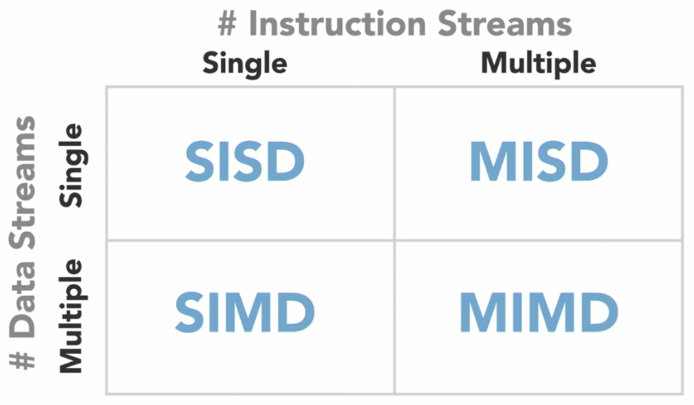
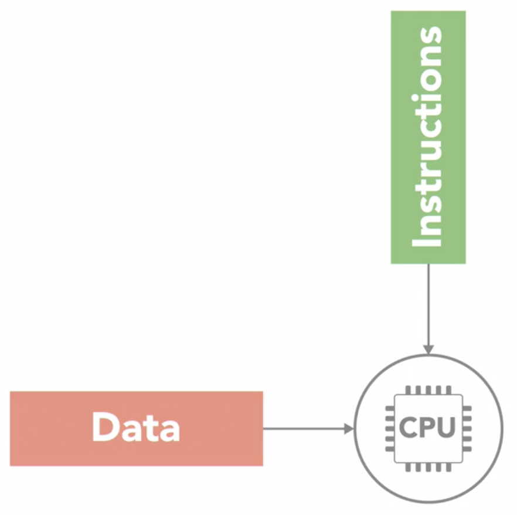
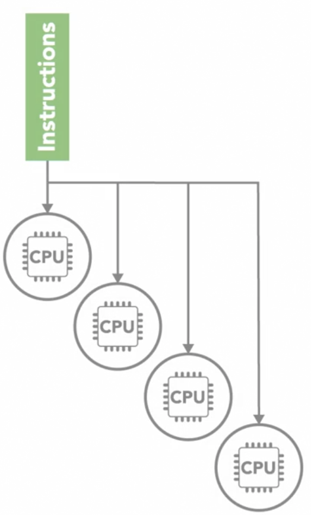
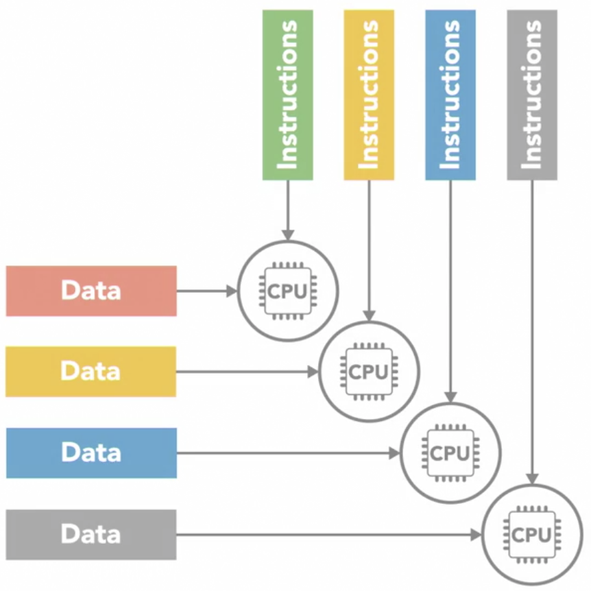
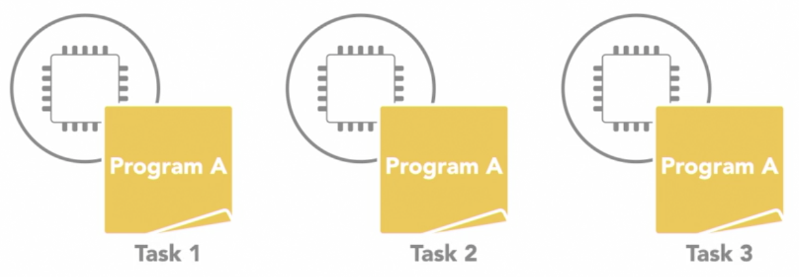
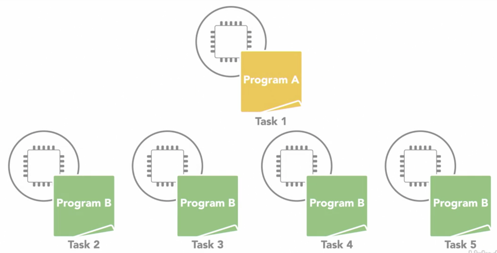
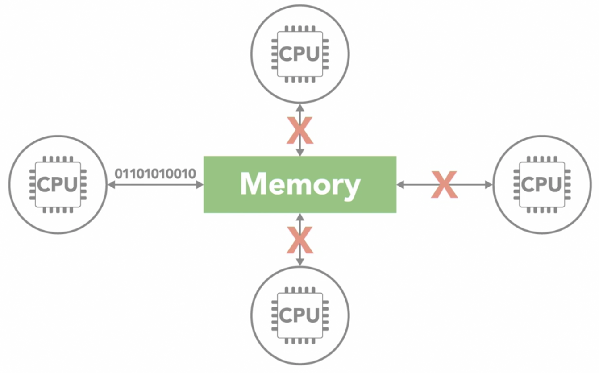
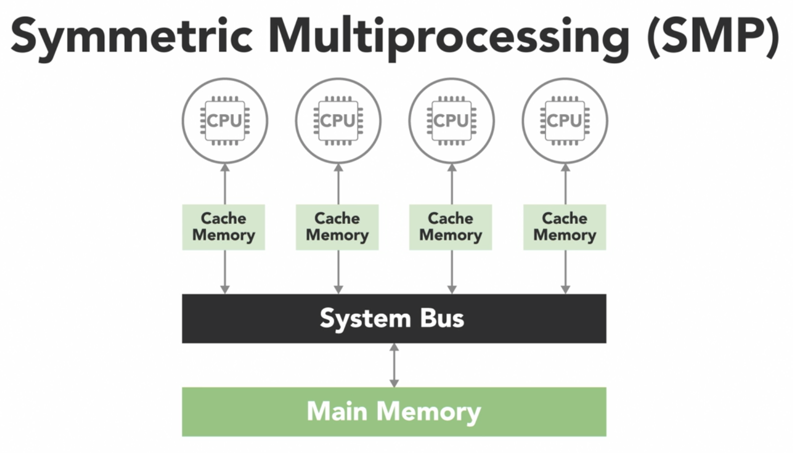
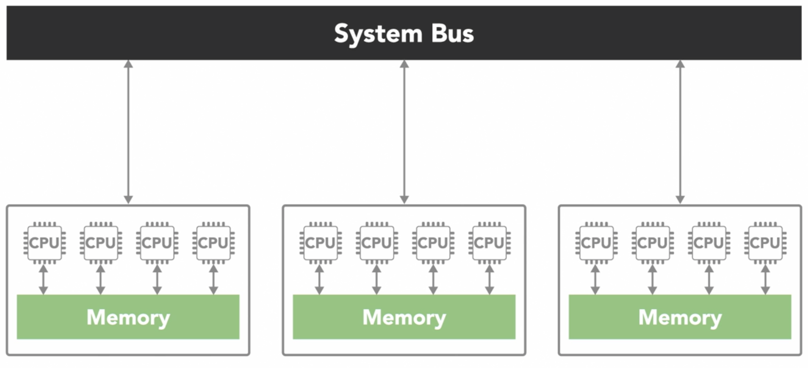
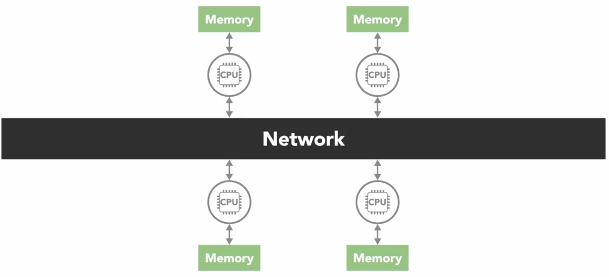

# Parallel, Concurrent and Multithreading
## Parallel Computing Hardware
### Sequential vs Parallel computing
#### sequential
- program is broken down into a sequence of discrete instructions that are executed one after another
- only can execute 1 instruction at any given moment
- limitations
  - the time it takes for a sequential program to run is limited by the speed of the processor
    - and how fast it can execute that series of instructions
#### parallel
- breaking the tasks for them to be executed simultaneously by different processors
  - accomplish a single task faster
  - accomplish more tasks in a given time
- the processors has to coordinate with each other as they might be dependent on each other
  - does not necessarily means speed will become twice as fast
    - if a separate task B requires task A but task A is still processing even though task B is completed
    - the entire process will have to wait until task A is completed
  - this adds complexity
### Parallel computing hardware
- parallel computing requires parallel hardware
  - with multiple processors to execute different parts of a program at the same time
- different structural types of parallel computers
  - `Flynn's Taxonomy`: 1 of most widely used systems for classifying multiprocessor architectures
  
    
  
    - Single Instruction Single Data (SISD)
    
      
      
      - simplest of the 4 classes
      - it is the sequential computer with a single processor unit
        - at any given time, can only execute 1 series of instructions and act on 1 element of data at a time
    - Single Instruction Multiple DATA (SIMD)

      
      
      - a type of parallel computer with multiple processing units
      - all of its processors execute the same instruction at any given time
        - but they can operate on different data element
      - this type of SIMD architecture is well suited for apps that perform the same handful of operations on a massive set of data elements
        - e.g.: image processing
          - most modern computers use graphic processing units (GPU) with SIMD instructions to do it
    - Multiple Instruction Single Data (MISD)
    
      
      
      - the opposite of `SIMD`
      - each processing unit independently executes its own separate series of instructions
        - however, all of those processors are operating on the same single stream of data
      - `MISD` doesn't make much practical sense, thus its not a commonly used architecture
    - Multiple Instruction Multiple Data (MIMD)
      
      
      
      - every processing unit can be operating on a different set of data
      - it is the most commonly used architecture
      - can find it in multicore PCs, network clusters, supercomputers
      - can be further subdivided into 2 parallel programming models
        - Single Program Multiple Data (SPMD)
        
          
          
          - multiple processing units are executing a copy of the same single program simultaneously
            - but each can use different data
          - different from `SIMD` because although each processor is executing the same program
            - they do not have to be executing the same instruction at the same time
            - the processors can run asynchronously
            - the program usually includes conditional logic that allows different tasks within the program to only execute specific parts of the overall program
          - it is the most common style of parallel programming
        - Multiple Program Multiple Data (MPMD)
        
          
        
          - each processors is executing a different program
          - processors can be executing different, independent programs at the same time while also be operating on different data
          - typically in this model, 1 processing node will be selected as the host or manager
            - which runs 1 program that farms out data to the other nodes running a 2nd program
            - those other nodes do their work and return their results to the manager
          - it is not as common as `SPMD` but can be useful for some applications that lend themselves to functional decomposition
### Shared vs distributed memory
- accessing memory needs to be fast enough to get the instructions and data required in order to be able to make use of more processors
- computer memory usually operates at a much slower speed than processors
- when 1 processor is reading or writing to memory, it often prevents any other processors from accessing the same memory element
  
  

- there are 2 main memory architectures that exists for parallel computing
  1. shared memory
      - all processors have access to the same memory as part of a global address space
      - although each processor operates independently
        - if 1 processor changes a memory location, all of the other processor operates will see that change
      - the term shared memory does not mean all data exists on the same physical device
        - it could be spread across a cluster of systems
        - the key is that both of the processors see everything that happens in the shared memory space
        - the shared memory architectures have the advantage of being easier for programming in regards to memory
          - because its easier to share data between different parts of a parallel program
        - disadvantage is that they don't often scale well
          - adding more processors to a shared memory system will increase traffic on the shared memory bus
          - shared memory puts responsibility on the programmer to synchronize memory accesses to ensure correct behavior
        - often classified into 1 of 2 categories, which are based on how the processors are connected to memory and how quickly they can access it
          - Uniform memory access (UMA)
            - all of the processors have equal access to the memory
              - means that they can access it equally fast
            - several types of UMA architectures
              - most common is `symmetric multiprocessing system` (SMP)
                
                
                
                - has 2 or more identical processors which are connected to a single shared memory often through a system bus
                - in modern multicore processors, each of the processing cores are treated as a separate processor
                - in most modern processors, each core has its own cache
                  - it is a small and very fast piece of memory that only it can see and it uses it to store data that it's frequently working with
                  - however, caches introduces the challenge that if 1 processor copies a value from the shared main memory, then makes a change to it in its local cache
                    - that change needs to be updated back in the shared memory before another processor reads the old value, which is no longer current
                    - this issue is called `cache coherency`
                    - handled by the hardware in multicore processors
          - Non-uniform memory access (NUMA)
          
            
          
            - often made by physically connecting multiple `SMP` systems together
            - the access is nonuniform because some processors will have quicker access to certain parts of memory than others
            - it takes longer to access things over the bus
            - overall, every processor can still see everything in memory
  2. distributed memory

      

      - in a distributed memory system, each processor has its own local memory with its own address space
      - concept of a global address space doesn't exist
      - all the processors are connected through some sort of network, which can be as simple as `Ethernet`
      - each processor operates independently
        - if it makes changes to its local memory, that change is not automatically reflected in the memory of other processors
        - it is up to the programmers to explicitly define how and when data is communicated between the nodes in a distributed system
          - this is a disadvantage
      - advatange of a distributed memory architecture is that its scalable
        - when more processors are added to the system, memory also increases
        - it makes it cost effector to use commodity, of the shelf computers and networking equipment to build large distributed memory systems
      - most supercomputers use some form of distributed memory architecture or a hybrid of distributed and shared memory
