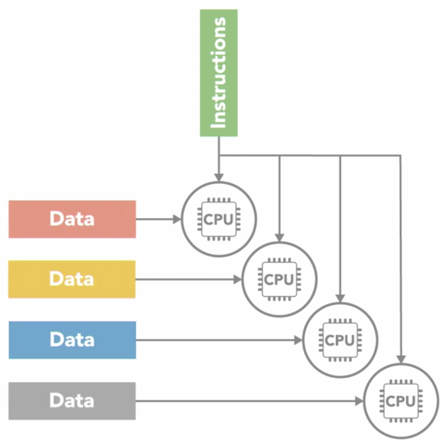
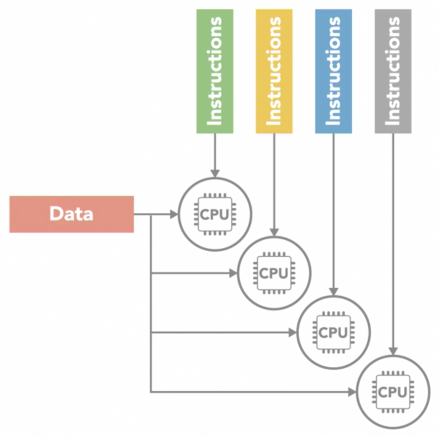

# Parallel, Concurrent and Multithreading
## Parallel Computing Hardware
### Sequential vs Parallel computing
#### sequential
- program is broken down into a sequence of discrete instructions that are executed one after another
- only can execute 1 instruction at any given moment
- limitations
  - the time it takes for a sequential program to run is limited by the speed of the processor
    - and how fast it can execute that series of instructions
#### parallel
- breaking the tasks for them to be executed simultaneously by different processors
  - accomplish a single task faster
  - accomplish more tasks in a given time
- the processors has to coordinate with each other as they might be dependent on each other
  - does not necessarily means speed will become twice as fast
    - if a separate task B requires task A but task A is still processing even though task B is completed
    - the entire process will have to wait until task A is completed
  - this adds complexity
### Parallel computing hardware
- parallel computing requires parallel hardware
  - with multiple processors to execute different parts of a program at the same time
- different structural types of parallel computers
  - `Flynn's Taxonomy`: 1 of most widely used systems for classifying multiprocessor architectures
  
    
  
    - Single Instruction Single Data (SISD)
    
      
      
      - simplest of the 4 classes
      - it is the sequential computer with a single processor unit
        - at any given time, can only execute 1 series of instructions and act on 1 element of data at a time
    - Single Instruction Multiple DATA (SIMD)

      
      
      - a type of parallel computer with multiple processing units
      - all of its processors execute the same instruction at any given time
        - but they can operate on different data element
      - this type of SIMD architecture is well suited for apps that perform the same handful of operations on a massive set of data elements
        - e.g.: image processing
          - most modern computers use graphic processing units (GPU) with SIMD instructions to do it
    - Multiple Instruction Single Data (MISD)
    
      
      
      - the opposite of `SIMD`
      - each processing unit independently executes its own separate series of instructions
        - however, all of those processors are operating on the same single stream of data
      - `MISD` doesn't make much practical sense, thus its not a commonly used architecture
    - Multiple Instruction Multiple Data (MIMD)
      
      
      
      - every processing unit can be operating on a different set of data
      - it is the most commonly used architecture
      - can find it in multicore PCs, network clusters, supercomputers
      - can be further subdivided into 2 parallel programming models
        - Single Program Multiple Data (SPMD)
        
          
          
          - multiple processing units are executing a copy of the same single program simultaneously
            - but each can use different data
          - different from `SIMD` because although each processor is executing the same program
            - they do not have to be executing the same instruction at the same time
            - the processors can run asynchronously
            - the program usually includes conditional logic that allows different tasks within the program to only execute specific parts of the overall program
          - it is the most common style of parallel programming
        - Multiple Program Multiple Data (MPMD)
        
          
        
          - each processors is executing a different program
          - processors can be executing different, independent programs at the same time while also be operating on different data
          - typically in this model, 1 processing node will be selected as the host or manager
            - which runs 1 program that farms out data to the other nodes running a 2nd program
            - those other nodes do their work and return their results to the manager
          - it is not as common as `SPMD` but can be useful for some applications that lend themselves to functional decomposition
