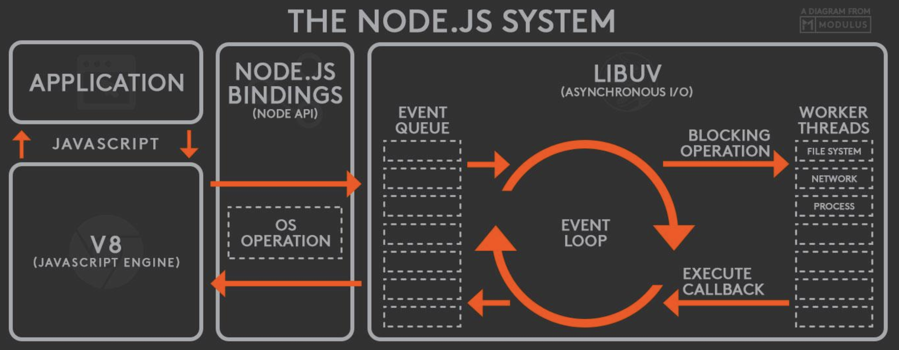

# NodeJS

## Introduction

- Node.js is an open-source and cross-platform JavaScript runtime environment
- it runs the `V8 JavaScript engine`, the core of Google Chrome, outside of the browser
  - This allows Node.js to be very performant
- A Node.js app runs in a `single process`, without creating a new thread for every request
  - Node.js provides a set of asynchronous I/O primitives in its standard library that prevent JavaScript code from blocking
  - libraries in Node.js are written using non-blocking paradigms, making blocking behavior the exception rather than the norm
- When Node.js performs an I/O operation, like reading from the network, accessing a database or the filesystem
  - instead of blocking the thread and wasting CPU cycles waiting, Node.js will resume the operations when the response comes back
  - This allows Node.js to handle thousands of concurrent connections with a single server without introducing the burden of managing thread concurrency
    - which could be a significant source of bugs
- you are in charge of deciding which ECMAScript version to use by changing the Node.js version
  - you can also enable specific experimental features by running Node.js with flags

## Difference between NodeJS and the browser

- Both the browser and Node.js use JavaScript as their programming language
- the difference lies in the ecosystem
  - In the browser
    - most of the time what you are doing is interacting with the DOM, or other Web Platform APIs like Cookies
    - we don't have all the nice APIs that Node.js provides through its modules
      - e.g.: filesystem access functionality
    - in the browser environment, you don't get to choose what browser your visitors will use
    - Since JavaScript moves so fast, but browsers can be a bit slow to upgrade
      - sometimes on the web you are stuck with using older JavaScript / ECMAScript releases
      - You can use Babel to transform your code to be ES5-compatible before shipping it to the browser
      - in the browser we are starting to see the ES Modules standard being implemented
      - you are limited to import in the browser
  - In Node.js
    - don't have the document, window and all the other objects that are provided by the browser
    - you control the environment
      - Unless you are building an open source application that anyone can deploy anywhere, you know which version of Node.js you will run the application on
      - This means that you can write all the modern ES6-7-8-9 JavaScript that your Node.js version supports
    - it supports both the CommonJS and ES module systems (since Node.js v12)
    - you can use both `require()` and `import` in Node.js

## V8 JavaScript Engine

- V8 is the name of the JavaScript engine that powers Google Chrome
  - It's the thing that takes our JavaScript and executes it while browsing with Chrome
- i.e. it parses and executes JavaScript code
  - The DOM, and the other Web Platform APIs (they all makeup runtime environment) are provided by the browser
- the JavaScript engine is independent of the browser in which it's hosted
  - This key feature enabled the rise of Node.js
  - V8 was chosen to be the engine that powered Node.js back in 2009
  - as the popularity of Node.js exploded, V8 became the engine that now powers an incredible amount of server-side code written in JavaScript
- The Node.js ecosystem is huge and thanks to V8 which also powers desktop apps, with projects like Electron
- V8 is written in C++, and it's continuously improved
  - It is portable and runs on Mac, Windows, Linux and several other systems

## Compilation

- JavaScript is generally considered an interpreted language
  - but modern JavaScript engines no longer just interpret JavaScript, they compile it
    - This has been happening since 2009, when the SpiderMonkey JavaScript compiler was added to Firefox 3.5, and everyone followed this idea
- JavaScript is internally compiled by V8 with just-in-time (JIT) compilation to speed up the execution
- Our applications can now run for hours inside a browser, rather than being just a few form validation rules or simple scripts
- compiling JavaScript makes perfect sense because
  - although it might take a little bit more to have the JavaScript ready
  - once done it's going to be much more performant than purely interpreted code

## NodeJS Event Loop



### Introduction

- what is the node event loop?

  - it is a semi-infinite while loop that allows Node.js to perform non-blocking I/O operations
    - despite the fact that JavaScript is single-threaded
    - by offloading operations to the system kernel whenever possible
    - Since most modern kernels are multi-threaded, they can handle multiple operations executing in the background
      - When one of these operations completes, the kernel tells Node.js so that the appropriate callback may be added to the poll queue to eventually be executed

- Why is this so important?
  - Because it explains how Node.js can be asynchronous and have non-blocking I/O
- The Node.js JavaScript code runs on a single thread
  - There is just one thing happening at a time
  - This is a limitation that's actually very helpful
    - as it simplifies a lot how you program without worrying about concurrency issues
    - You just need to pay attention to how you write your code
    - avoid anything that could block the thread, like synchronous network calls or infinite loops
- in most browsers there is an event loop for every browser tab
  - it makes every process isolated and avoid a web page with infinite loops or heavy processing to block your entire browser
- The environment manages multiple concurrent event loops, to handle API calls
  - Web Workers run in their own event loop as well
- You mainly need to be concerned that your code will run on a single event loop, and write code with this thing in mind to avoid blocking it

### Blocking the event loop

- Any JavaScript code that takes too long to return back control to the event loop will block the execution of any JavaScript code in the page
  - it even block the UI thread, and the user cannot click around, scroll the page, etc.
- Almost all the I/O primitives in JavaScript are non-blocking
  - Network requests, filesystem operations, and so on
  - Being blocking is the exception, and this is why JavaScript is based so much on callbacks, and more recently on promises and async/await

### The Call Stack

- The call stack is a LIFO (Last In, First Out) stack
- The event loop continuously checks the call stack to see if there's any function that needs to run
  - While doing so, it adds any function call it finds in the call stack and executes each one in order
- in the error stack trace from the debugger or in the browser console

  - the browser looks up the function names in the call stack to inform you which function originates the current call

    

### Simple event loop explanation

- When this code runs
  1. first `foo()` is called
  2. Inside `foo()` we first call `bar()`
  3. then we call `baz()`

```js
const bar = () => console.log("bar");

const baz = () => console.log("baz");

const foo = () => {
  console.log("foo");
  bar();
  baz();
};

foo();
```

```
foo
bar
baz
```


### Queuing function execution

- it defer a function until the stack is clear

- When this code runs
  1. first `foo()` is called
  2. Inside `foo()` we first call `setTimeout`, passing bar as an argument
     - we instruct it to run immediately as fast as it can, passing 0 as the timer
  3. Then we call `baz()`

```js
const bar = () => console.log("bar");

const baz = () => console.log("baz");

const foo = () => {
  console.log("foo");
  setTimeout(bar, 0);
  baz();
};

foo();
```

```
foo
baz
bar
```


### The Message Queue

- When `setTimeout()` is called, the Browser or Node.js starts the timer
  - Once the timer expires, in this case immediately as we put 0 as the timeout, the callback function is put in the Message Queue
- The Message Queue is also where user-initiated events like click or keyboard events, or fetch responses are queued before your code has the opportunity to react to them
  - Or also DOM events like onload
- The loop gives priority to the call stack, and it first processes everything it finds in the call stack
  - once there's nothing in there, it goes to pick up things in the message queue
- We don't have to wait for functions like setTimeout, fetch or other things to do their own work
  - because they are provided by the browser, and they live on their own threads
  - For example, if you set the setTimeout timeout to 2 seconds, you don't have to wait 2 seconds
    - the wait happens elsewhere

### ES6 Job Queue

- ECMAScript 2015 introduced the concept of the Job Queue, which is used by Promises (also introduced in ES6/ES2015)
  - It's a way to execute the result of an async function as soon as possible, rather than being put at the end of the call stack
- Promises that resolve before the current function ends will be executed right after the current function
- Similar to a rollercoaster ride at an amusement park
  - the message queue puts you at the back of the queue, behind all the other people, where you will have to wait for your turn
  - while the job queue is the fastpass ticket that lets you take another ride right after you finished the previous one

```js
const bar = () => console.log("bar");

const baz = () => console.log("baz");

const foo = () => {
  console.log("foo");
  setTimeout(bar, 0);
  new Promise((resolve, reject) =>
    resolve("should be right after baz, before bar")
  ).then((resolve) => console.log(resolve));
  baz();
};

foo();
```

```
foo
baz
should be right after baz, before bar
bar
```


### Concurrency and Throughput

- JavaScript execution in Node.js is single threaded, so concurrency refers to the event loop's capacity to execute JavaScript callback functions after completing other work
  - Any code that is expected to run in a concurrent manner must allow the event loop to continue running as non-JavaScript operations, like I/O, are occurring
- As an example, let's consider a case where each request to a web server takes 50ms to complete and 45ms of that 50ms is database I/O that can be done asynchronously

  - Choosing non-blocking asynchronous operations frees up that 45ms per request to handle other requests
  - This is a significant difference in capacity just by choosing to use non-blocking methods instead of blocking methods

- The event loop is different than models in many other languages where additional threads may be created to handle concurrent work

## process.nextTick()

- Every time the event loop takes a full trip, we call it a tick
- When we pass a function to `process.nextTick()`

  - we instruct the engine to invoke this function at the end of the current operation, before the next event loop tick starts

  ```js
  process.nextTick(() => {
    // do something
  });
  ```

- The event loop is busy processing the current function code
  - When this operation ends, the JS engine runs all the functions passed to nextTick calls during that operation
    - It's the way we can tell the JS engine to process a function asynchronously (after the current function), but as soon as possible, not queue it
  - Calling `setTimeout(() => {}, 0)` will execute the function at the end of next tick, much later than when using `nextTick()` which prioritizes the call and executes it just before the beginning of the next tick
- Use `nextTick()` when you want to make sure that in the next event loop iteration that code is already executed

## setImmediate()

- When you want to execute some piece of code asynchronously, but as soon as possible
  - use the `setImmediate()` function provided by Node.js
- Any function passed as the `setImmediate()` argument is a callback that's executed in the next iteration of the event loop
- A function passed to `process.nextTick()` is going to be executed on the current iteration of the event loop after the current operation ends
  - This means it will always execute before setTimeout and setImmediate
- A `setTimeout()` callback with a 0ms delay is very similar to `setImmediate()`
  - The execution order will depend on various factors, but they will be both run in the next iteration of the event loop
- A `process.nextTick callback` is added to `process.nextTick queue`
  - A `Promise.then() callback` is added to promises microtask queue
  - A `setTimeout`, `setImmediate` callback is added to macrotask queue
- Event loop executes tasks in

  1. `process.nextTick` queue first
  2. then executes `promises.then()` microtask queue
  3. then executes `setTimeout`, `setImmediate`callbacks macrotask queue

- code will
  1. first call `start()`
  2. then call `foo()` in `process.nextTick` queue
  3. After that, it will handle `promises` microtask queue, which prints bar and adds `zoo()` in `process.nextTick` queue at the same time
  4. Then it will call `zoo()` which has just been added
  5. In the end, the `baz()` in macrotask queue is called

```js
const baz = () => console.log("baz");
const foo = () => console.log("foo");
const zoo = () => console.log("zoo");

const start = () => {
  console.log("start");
  setImmediate(baz);
  new Promise((resolve, reject) => {
    console.log("resolve");
    resolve("bar");
  }).then((resolve) => {
    console.log(resolve);
    process.nextTick(zoo);
  });
  process.nextTick(foo);
};

start();
```

```
start
resolve
foo
bar
zoo
baz
```

## JavaScript Timers

### setTimeout()

- When writing JavaScript code, you might want to delay the execution of a function
- You specify a callback function to execute later, and a value expressing how later you want it to run, in milliseconds

```js
// method 1
const myFunction = (firstParam, secondParam) => {
  // do something
};

// runs after 2 seconds
setTimeout(myFunction, 2000, firstParam, secondParam);

// method 2
setTimeout(() => {
  // do something with firstParam, secondParam
}, 2000);
```

- clearing timeout

  ```js
  const id = setTimeout(() => {
    // should run after 2 seconds
  }, 2000);

  // I changed my mind
  clearTimeout(id);
  ```

### setInterval()

- a function similar to setTimeout, with a difference: instead of running the callback function once, it will run it forever, at the specific time interval you specify (in milliseconds)

```js
// method 1
const id = setInterval(() => {
  // runs every 2 seconds
}, 2000);

clearInterval(id);

// method 2
const interval = setInterval(() => {
  if (App.somethingIWait === "arrived") {
    clearInterval(interval);
  }
  // otherwise do things
}, 100);
```

### Recursive setTimeout

- setInterval starts a function every n milliseconds, without any consideration about when a function finished its execution
  - if you need every function to execute after it has completed at a set interval, use recursive `setTimeout` instead

```js
const myFunction = () => {
  // do something

  setTimeout(myFunction, 1000);
};

setTimeout(myFunction, 1000);
```

### Orchestrating promises

#### Promise all

- If you need to synchronize different promises, `Promise.all()` helps you define a list of promises, and execute something when they are all resolved

```js
// method 1
const f1 = fetch("/something.json");
const f2 = fetch("/something2.json");

Promise.all([f1, f2])
  .then((res) => {
    console.log("Array of results", res);
  })
  .catch((err) => {
    console.error(err);
  });

// method 2
Promise.all([f1, f2]).then(([res1, res2]) => {
  console.log("Results", res1, res2);
});
```

#### Promise race

- `Promise.race()` runs when the first of the promises you pass to it settles (resolves or rejects), and it runs the attached callback just once, with the result of the first promise settled
  - only have 1 winner

```js
const first = new Promise((resolve, reject) => {
  setTimeout(resolve, 500, "first");
});
const second = new Promise((resolve, reject) => {
  setTimeout(resolve, 100, "second");
});

Promise.race([first, second]).then((result) => {
  console.log(result); // second
});
```

#### Promise any

- `Promise.any()` settles when any of the promises you pass to it fulfill or all of the promises get rejected
- It returns a single promise that resolves with the value from the first promise that is fulfilled
- If all promises are rejected, then the returned promise is rejected with an AggregateError

```js
const first = new Promise((resolve, reject) => {
  setTimeout(reject, 500, "first");
});
const second = new Promise((resolve, reject) => {
  setTimeout(reject, 100, "second");
});

Promise.any([first, second]).catch((error) => {
  console.log(error); // AggregateError
});
```
