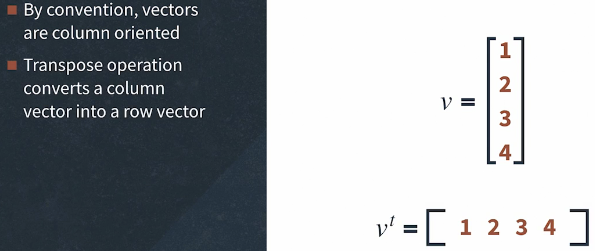

# Linear Algebra
It is the study of vectors and linear functions.
- Explanation 1:
  - It is a branch of mathematics that lets you concisely describe coordinates and interactions of planes in higher dimensions and perform operations on them.
- Explanation 2:
  - Linear algebra is a branch of mathematics that deals with vectors (quantities with both magnitude and direction), matrices (rectangular arrays of numbers), and linear transformations (functions that preserve addition and scalar multiplication).
- Explain like I am 5
  - Imagine you have a bunch of LEGO blocks. Each block is like a number, and you can stack them differently. If you line them up in rows and columns, that’s like a matrix. If you push or stretch them in a certain direction, that’s like a transformation. Linear algebra helps us understand how things change when we add, move, or pull these blocks in a straight and predictable way. It’s like playing with numbers in an organized way.
- it is 1 of the main building blocks of machine learning
## Applications in Machine Learning
1. Data set and Date Files
    - We fit the model on a data set in ML
    - This data set is either a matrix or a vector
    - e.g.: our model could be a fitness-related model that predicts the quality of sleep
2. Images and Photographs
    - Computer vision application
      - you cannot send an image to a model and expect it to understand
      - each image is made of pixels that are colored squares of varying intensities
      - a black and white image is a single-pixel
      - a colored image has 3-pixel values for RGB
      - all images are stored as a matrix
      - each operation (e.g.: cropping, scaling, et cetera) that is performed on the image is described using the notation and operations of linear algebra 
3. Data Preparation
    - dimensionality reduction
      - usually, we come across data that is made up of thousands of variables and our model becomes extremely complicated
      - this is when dimensionality reduction comes into play
      - data sets are represented as matrices and then we can use matrix factorization methods to reduce it into its constituent parts
    - 1 hot encoding
      - it is used when working with categorical data
        - such as class labels for classification problems or categorical input variables
      - it is common to encode categorical variables to make them easier to work with
4. Linear Regression
    - Used for predicting numerical values in simple regression problems
    - the most common way of solving linear regression is via the least squares optimization which is solved using matrix factorization methods from linear regression
5. Regularization
    - Overfitting is 1 of the greatest obstacles in ML
    - When a model is too close a fit for the available data to the point that it does not perform well with any new or outside data
    - It is a concept from Linear algebra that is used to prevent the model from overfitting
    - Simple models are models that have smaller coefficient values
    - It is a technique that is often used to encourage a model to minimize the size of coefficients while it's being fit on data
6. Principal Component Analysis (PCA)
    - modeling data with many features is challenging and it's hard to know which features of data are relevant and which are not
    - 1 of the methods for automatically reducing the number of columns of a data set is principle component analysis
    - this method is used in ML to create projections of high dimensional data for both visualization and training models
    - The core of the PCA method is a metric factorization method
7. Latent Semantic Analysis (LSA)
    - it is a form of data preparation used in natural language processing, a subfield of ML for working with text data
    - in this case, documents are usually represented as a large matrix of word occurrences
    - then we can apply matrix factorization methods to them to be able to easily compare, query, and use them as the basis for the ML model
8. Recommender Systems
    - They are used each time you buy something on Amazon or a similar shop and you get recommendations of products based on your previous purchases
9. Deep Learning (DL)
    - it is a specific subfield of ML
    - Scaled up to multiple dimensions, DL methods work with vectors, matrices, and tensors of inputs and coefficients
## Vectors
### Scalar
- it is just a number
- we denote a scalar with a lower-case symbol, such as a or b
- e.g.: weight, temperature, blood pressure
  - they are represented by numbers such as 200 pounds, 55 Fahrenheit, or 120 by 80
### Vector

- The 2 most important characteristics of vectors


  1. Dimensionality
      - the number of elements in a vector
      - it is called `length` or the `shape` of the vector in python
  2. Orientation
      - whether the vector is in column orientation standing up tall, or row orientation laying flat and wide
- Vector Examples


  - Orientation usually doesn't matter, but when performing arithmetic operations it is extremely important
    - wrong orientation leads to unexpected results or even errors


  - If they're row-oriented, then they are written as with `t` where t indicates the transpose operation which converts a column vector into a row vector.


  - the red arrow v is the vector
  - a and b are scalars denoting the magnitude of v in horizontal and vertical directions.
  - The algebraic interpretation of a vector is an ordered list of numbers.
  - The geometric interpretation of a vector is a line that has a specific length and direction also called an angle.
  - It is computed relative to the positive X-axis.
  - The two points of a vector are called the tail, where the vector starts, and the head which has the arrow tip, where it ends.

- Vector Representation in python
```python
# Many linear algebra operations don't work on Python lists, we create vectors as NumPy arrays called ND (N-dimensional) arrays
vectorAsList = [1, 2, 3, 4, 5]

# This array is an orientation-less array meaning it's neither a row nor a column vector
vectorAsArray = np.array([1, 2, 3, 4, 5])

# In NumPy, we indicate orientation with brackets
# the outer brackets just group all elements together in one object as an additional set of brackets indicates a row
rowVector = np.array([[1, 2, 3, 4, 5]])

# It has only one column and five rows
columnVector = np.array([[1], [2], [3], [4], [5]])
```

### Vector addition

  - To add two vectors, add each corresponding element.
  - We cannot add a three-dimensional vector with a four-dimensional vector
- dimensions don't match the error example
```python
import numpy as np

a = np.array([20, 40, 60])
b = np.array(10, 20, 30)
c = np.array([5, 10, 15, 20])

a + b  # array([30, 60, 90])

a + c  # ValueError: operands could not be broadcast together with shapes (3,) (4,)
```


- To add two vectors, you have to place the vectors such that the tail of one vector is at the head of the other vector.
- The sum vector traverses from the tail of the first vector to the head of the second
### Vector Subtraction

  - We cannot subtract a three-dimensional vector from a four-dimensional vector
- dimensions don't match the error example
```python
import numpy as np

a = np.array([20, 40, 60])
b = np.array(10, 20, 30)
c = np.array([5, 10, 15, 20])

a - b  # array([10, 20, 30])

a - c  # ValueError: operands could not be broadcast together with shapes (3,) (4,)
```


- To subtract vectors, you have to up the two vectors such that their tails are at the same coordinate.
- The difference vector is the line that goes from the head of the negative vector to the head of the positive vector.
### Vector Multiplication
- example
```python
import numpy as np

a = np.array([20, 40, 60])
b = np.array(10, 20, 30)
c = np.array([5, 10, 15, 20])

a * b  # array([200, 800, 1000])
```
### Vector Division
```python
import numpy as np

a = np.array([20, 40, 60])
b = np.array(10, 20, 30)
c = np.array([5, 10, 15, 20])

a / b  # array([2., 2., 2.])
```
### Vector Scalar multiplication
- multiply each vector element by the scalar
- example
```python
import numpy as np

scalar = 2

list_a = [10, 11, 12, 13, 14, 15]

list_as_array = np.array(list_a)  # [10 11 12 13 14 15]

scalar * list_a  # This is wrong, value is [10, 11, 12, 13, 14, 15, 10, 11, 12, 13, 14, 15]

scalar * list_as_array  # array([20, 22, 24, 26, 28, 30])
```


- we have four possible cases that depend on whether the scalar is
  - greater than 1
  - between 1 and 0
  - exactly 0
  - or negative
    - Only in the case when the scalar is negative, the direction of the vector will change
### Cartesian Coordinate System

- we can locate a point by its combination of numbers
- it is important because it describes where a certain position is located in a 2-dimensional area
- Coordinates have 2 numbers (x-coordinate and y-coordinate)
- The x-axis runs left and right, the y-axis runs up and down
- The axes x and y meet at (0, 0) coordinate at the center which is called the origin
- A point is denoted by its distance along the x-axis followed by its distance along the y-axis


