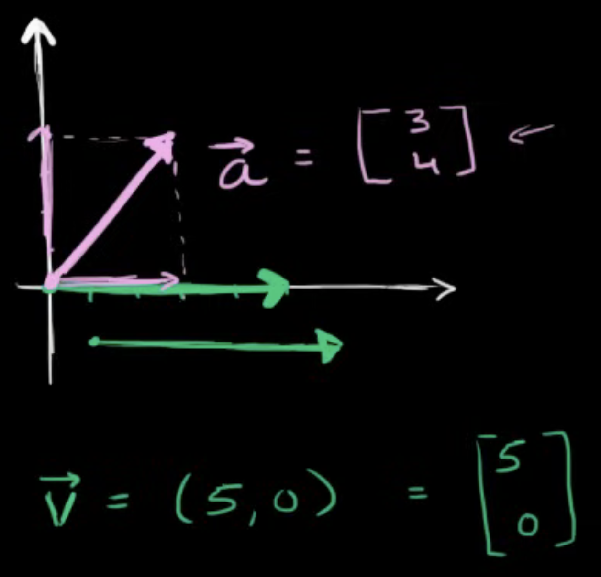

# Linear Algebra
## Vector intro for linear algebra
### **What is a Vector?**
- A vector has both **magnitude** (size) and **direction**.
- Example:
  - **Not a vector**: "Moving at 5 miles per hour" (only magnitude).
  - **Vector**: "Moving at 5 miles per hour **east**" (magnitude + direction).
  - **Speed** is a scalar (only magnitude), while **velocity** is a vector (magnitude + direction).

### **Visualizing a Vector**


- A vector can be represented as an **arrow**:
  - **Arrow length** = magnitude of the vector.
  - **Arrow direction** = direction of the vector.
- Vectors can be moved around if they keep the same magnitude and direction.

### **Vector Representation in 2D**
- In two dimensions, a vector is written as **(x, y)**:
  - The **first value** (x) represents movement in the horizontal direction.
  - The **second value** (y) represents movement in the vertical direction.
- Example:
  - A vector v moving **5 units east**: **(5, 0)**
  - A vector a moving **3 right and 4 up**: **(3, 4)**

### **Column Vector Notation**
- Instead of writing as a row **(x, y)**, vectors are often written as **column vectors**:
```
[ 5 ]
[ 0 ]
```
- This format is widely used in linear algebra.

### **Magnitude of a Vector**
- The **length** of a vector can be found using the **Pythagorean theorem**:
- For a vector **(3, 4)**:
  ```
  Magnitude = √(3² + 4²) = √9 + 16 = √25 = 5
  ```
- This is useful in determining the size of a vector.

### **Extending Vectors to Higher Dimensions**
- Linear algebra allows working with vectors in **3D, 4D, or even higher dimensions**.
- While we can visualize up to 3D, **mathematical notation** helps work with higher dimensions.
