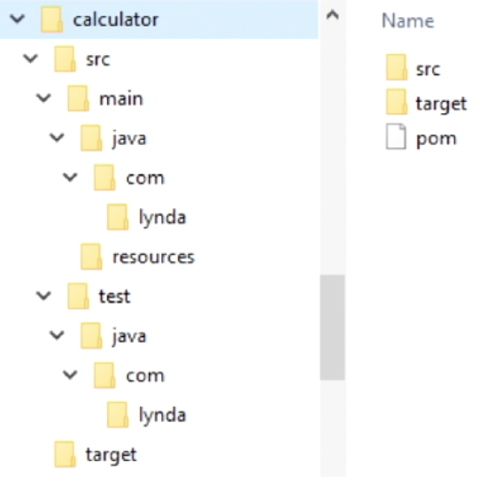
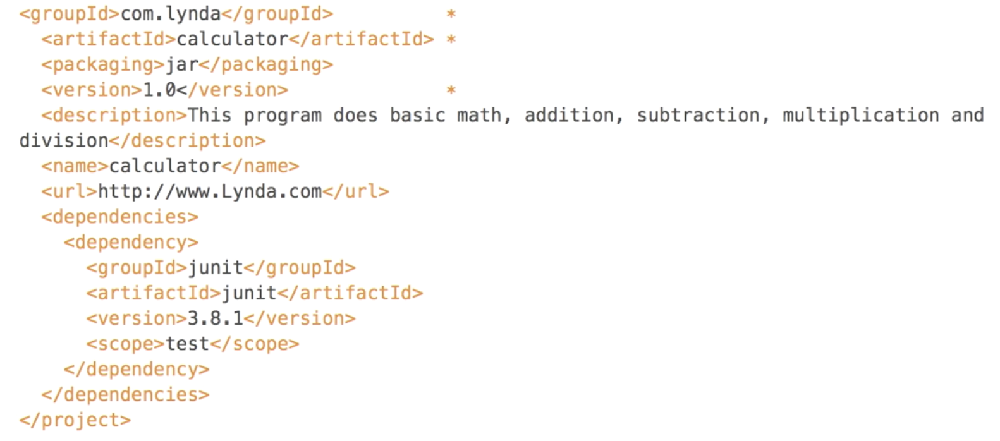

# Apache Maven
- standard definition
  - a software project management and comprehension tool
  - based on the concept of a Project Object Model (POM)
    - Maven can manage a project's build, reporting and documentation from a central piece of information
- simple definition
  - a project management tool with a POM
  - a set of standards
  - a project life cycle
  - a dependency management system
  - logic for executing plugin goals at lifecycle phases
  - projects follow a consistent structure
  - projects are IDE agnostic
  - Maven allows for easy modifications to the project
  - Maven simplifies the declaration of project dependencies
  - it uses a POM file
## Installation
- install with brew
  > brew install maven
- check maven version
  > mvn -version
## Project Object Model (POM)
- it has a set of standards, a project lifecycle, a dependency management system, and logic for executing plugin at defined phases in a lifecycle
- projects are set up with default behaviors
- source code must be in the `src/main/` folder
- resources necessary for the project are in another folder
- test cases are in a specifically name folder
- `target folder` is used for the final JAR file



### POM file
- must include
  - project description
  - unique set of "coordinates"
    - highlighted by `*`
      - groupId
      - artifactId
      - version
  - project attributes
  - project's license
  - project version
  - program authors and contributors
  - dependencies



#### features enabled by POM
- includes
  - dependency management
  - access to remote repositories
  - universal reuse of build logic
  - tool portability and integration
    - allow IDEs to have a common place to find information about a project
  - easy searching and filtering of project artifacts

#### Maven Life Cycle
```
Generate a project <------
     |                   |
     v                   |
Execute Maven            |
     |                   |
     v                   |
Install a Maven artifact |
     |                   |
     v                   |
Run the app _____________|
```
##### default life cycle phases
1. Validate
    - validate the project is correct
2. Compile
    - compile the source of the project
3. Test
    - test the compiled source code using a unit testing framework
4. Package
    - package the compiled code
5. Integration-test
    - deploy the package into an environment where integration tests can be run
6. Verify
    - run any checks to verify the package is valid
7. Install
    - install the package into the local repository
8. Deploy
    - copies the final package to the remote repository
- plugin goals can be attached to each lifecycle phase
- maven executes the goals attached to each phase
- each phase has 0 or more goals bound to it
- when you run `mvn install`, multiple goals are executed
  - `target/` folder with all the compiled code and jar file
- in the package phase, it executes the JAR goal
### Maven Repository
- central repository that contains open-source components
- Maven creates a local repository at `~/.m2` location
  - foreign dependencies are installed here
  - it also includes your JAR file and `pom.xml` file for each install project
  - [Maven repo search url address](https://search.maven.org/)
### Maven Dependency Management
- allows for code reuse
- similar to using Java APIs
- most programmers have used the Math API
- a common dependency in Maven is `junit`
- dependencies are defined in the `pom.xml` file
  - `scope` tag identifies what part of the life cycle the dependency is going to be used in
### pom.xml file
#### POM Categories
- the POM contains all of the information about a project
- the file is stored with an XML extension
- minimum categories required
  ```xml
  <project>
    <groupId>com.projectname</groupId>
    <artifactId>appname</artifactId>
    <version>1.0</version>
  </project>
  ```
- common categories
  - project coordinates
  - project's license
  - list of developers and contributors to the project
  - list of project dependencies
  - name of project
  - url associated with project
  - packaging type
  - scope of element
  - information about inheritance
#### POM syntax
