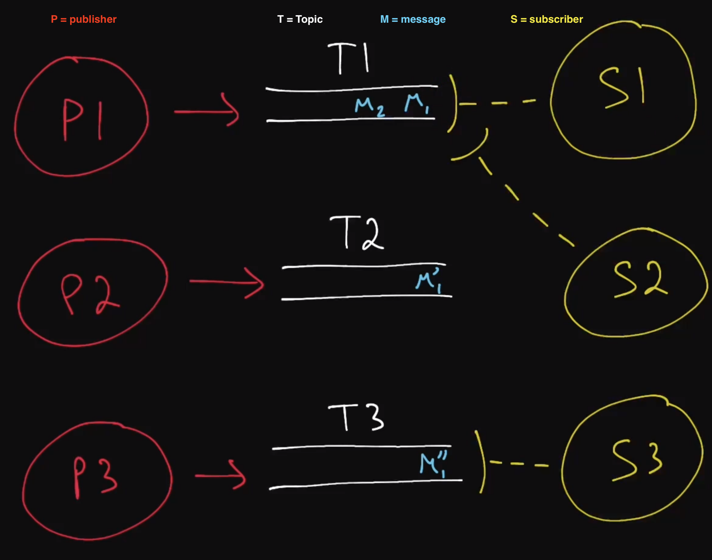

# Publish / Subscribe Pattern
- often shortened as Pub/Sub
- often come with very powerful guarantees like at-least-once delivery, persistent storage, ordering of messages, and replayability of messages
- it is a popular messaging model that consists of publishers and subscribers
  - publishers publish messages to special topics (sometimes called channels) without caring about or even knowing who will read those messages
    - they are the servers where their job is to publish data to the topics and not to the clients
  - subscribers subscribe to topics and read messages coming through those topics
    - they are the clients that are subscribed to the topics
    - so they are listening for messages (data or information) from topics instead of from the publishers/servers
    - when a message is pushed out to the subscriber, the subscriber would then acknowledge receipt by sending the acknowledgement (ACK) to the topic
      - the message would then be flagged that it has been consumed by which subscriber
    - can also have content filtering of messages that they want to receive
  - topics
    - similar to like channels of specific information
      - each topic would have different types of data
    - data is being published or pushed from the publishers/servers
    - topics act as intermediaries between publishers and subscribers is like a database solution
    - topics also provides ordering of messages
      - as you send or publish messages to topics, they will be pushed to subscribers in the same order similar to a Queue data structure
  - messages
    - it represent some form of data or operation that is relevant to the subscribers
    - messages can be replayed in the topic if desired
    - all messages that are gonna be published to topics are going to be stored in persistent storage in the topics
      - this guarantees the delivery of the messages in a particular topic to the subscriber at least once
        - sometimes delivery might be sent more than once
          - this happens when the subsriber loses connection after the message is pushed out from the topic to the subscriber, thus the subscriber is unable to send back an ACK to the topic
          - when subscriber reconnects back, the message in the topic would assume that the subscriber has yet to receive the message and thus will be sent to the subscriber again
          - this introduces the concept of Idempotent operation
            - if the message that is being sent is an idempotent operation, it might be bad for the system, whether it is bad or not depends on the ultimate operation
              - e.g.: if only 1 user can like a youtube video once, it should not increment the number of likes more than once
                - for this case, it is a drawback for the pub/sub system
  
## When to use example
- in the chat application, we can use streaming paradigm as a solution
  - however, if we need to expand the system, we would get some issues
    - the moment the system becomes a distributed system, then we would need to think about how to handle network partitions
      - what do we do if our clients lose their connection with the servers, or servers die, what will happen to the messages, does it disappear, will clients be able to retrieve the messages if they lost connection?
- in a stock broker example, if we have clients who were streaming or listening to servers for data about stock prices
  - they were relying on those stock prices to execute important trades
    - what would happen if there were network partition?
- therefore, the moment we start to deal with distributed systems, we have to deal with persistent storage for a lot of parts of our system
  - however, in this typical case an asynchronous operation made by the client would go to the server and then will take some time for it to be completed before going back to the client
    - this might not be something you would want to store in the typical database solution if response speed is important
- a naive solution would be to store the data at the server level, where the clients are issuing the asynchronous operations to
  - however, you probably don't want to have your storage solution or custom built storage solution at the server level
    - the business logic which is what the server is doing should likely be separated out from the storage solution
    - it would be better to separate the duties in the system
- this is where the pub/sub system comes into play
## Pub/Sub tools
### [Apache Kafka](https://kafka.apache.org/)
- a distributed messaging system created by LinkedIn
- very useful when using the streaming paradigm as opposed to polling
### [Google Cloud Pub/Sub](https://cloud.google.com/pubsub)
- a highly-scalable Pub/Sub messaging service created by Google
- Gurantees at-least-once delivery of messages and supports "rewinding" in order to reprocess messages
- things like sharding at the topic level, end-to-end encryption are all taken care of
## Terms Used
### Idempotent Operation
- an operation that has the same ultimate outcome regardless of how many times it's performed
- it is idempotent if an operation can be performed multiple times without changing its overall effect
- Operations performed through a Pub/Sub messaging system typically have to be idempotent
  - since Pub/Sub systems tend to allow the same messages to be consumed multiple times
- e.g.:
  - increasing an integer value in a database is not an idempotent operation
    - since repeating this operation will not have the same effect as if it had been performed only once
    - conversly, setting a value to "COMPLETE" is an idempotent operation, since repeating this operation will always yield the same result
      - the value will be "COMPLETE"
